Bend
####

ARC_NWG_C_TE
************
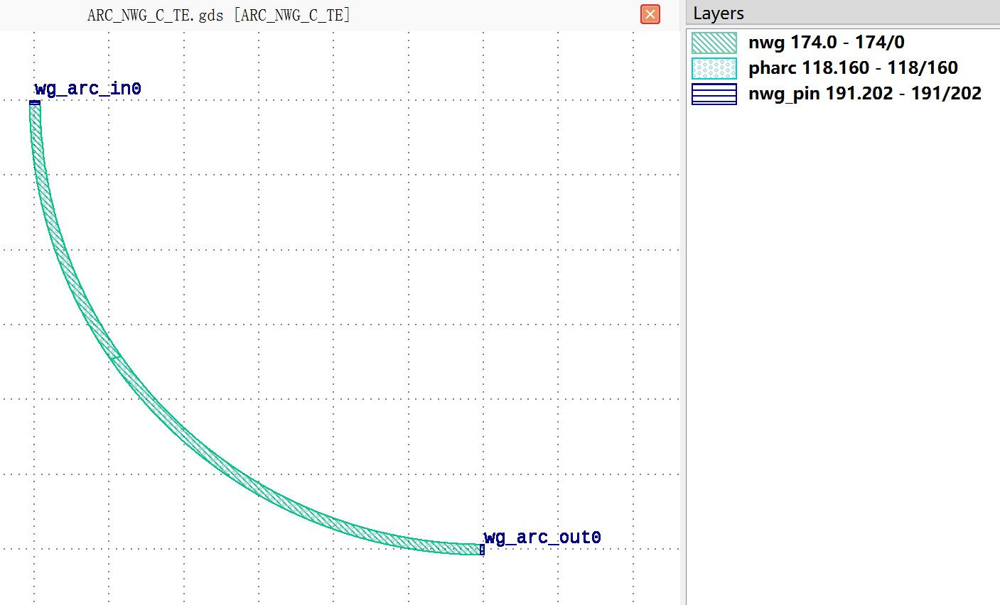

+-----------------------------+---------------------------------------------+-----------------------------+
|            ports            |                waveguide type               |         orientation         |
+=============================+=============================================+=============================+
|          wg_arc_in0         |         TECH.WG.SiN_strip.C.WIRE_TE         |              90             |
+-----------------------------+---------------------------------------------+-----------------------------+
|         wg_arc_out0         |         TECH.WG.SiN_strip.C.WIRE_TE         |              0              |
+-----------------------------+---------------------------------------------+-----------------------------+

ARC_NWG_C_TM
************
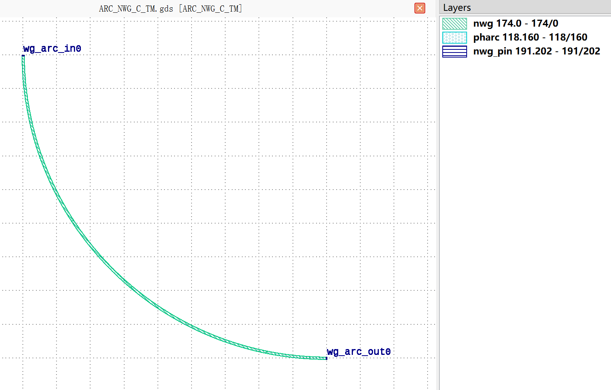

+-----------------------------+---------------------------------------------+-----------------------------+
|            ports            |                waveguide type               |         orientation         |
+=============================+=============================================+=============================+
|          wg_arc_in0         |         TECH.WG.SiN_strip.C.WIRE_TM         |              90             |
+-----------------------------+---------------------------------------------+-----------------------------+
|         wg_arc_out0         |         TECH.WG.SiN_strip.C.WIRE_TM         |              0              |
+-----------------------------+---------------------------------------------+-----------------------------+

ARC_NWG_O_TE
************
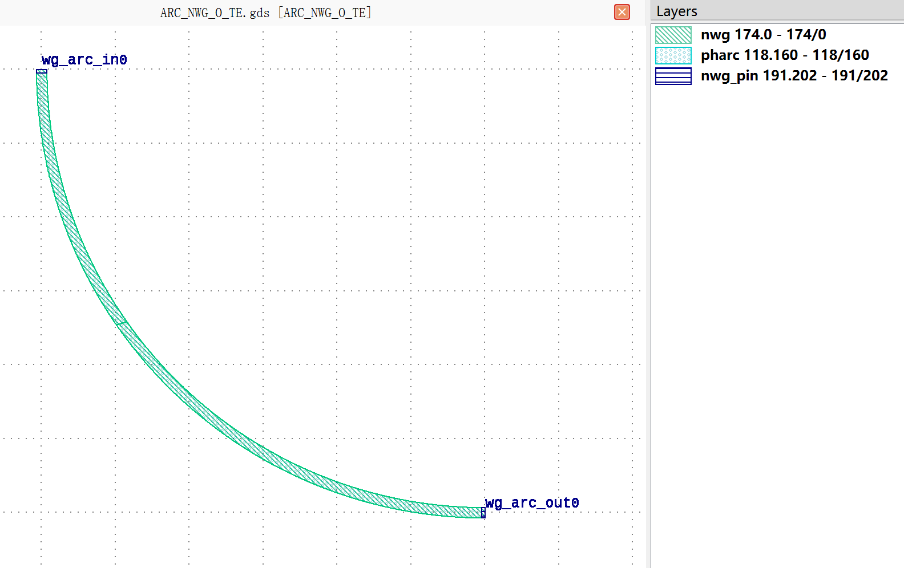

+-----------------------------+---------------------------------------------+-----------------------------+
|            ports            |                waveguide type               |         orientation         |
+=============================+=============================================+=============================+
|          wg_arc_in0         |         TECH.WG.SiN_strip.O.WIRE_TE         |              90             |
+-----------------------------+---------------------------------------------+-----------------------------+
|         wg_arc_out0         |         TECH.WG.SiN_strip.O.WIRE_TE         |              0              |
+-----------------------------+---------------------------------------------+-----------------------------+

ARC_NWG_O_TM
************
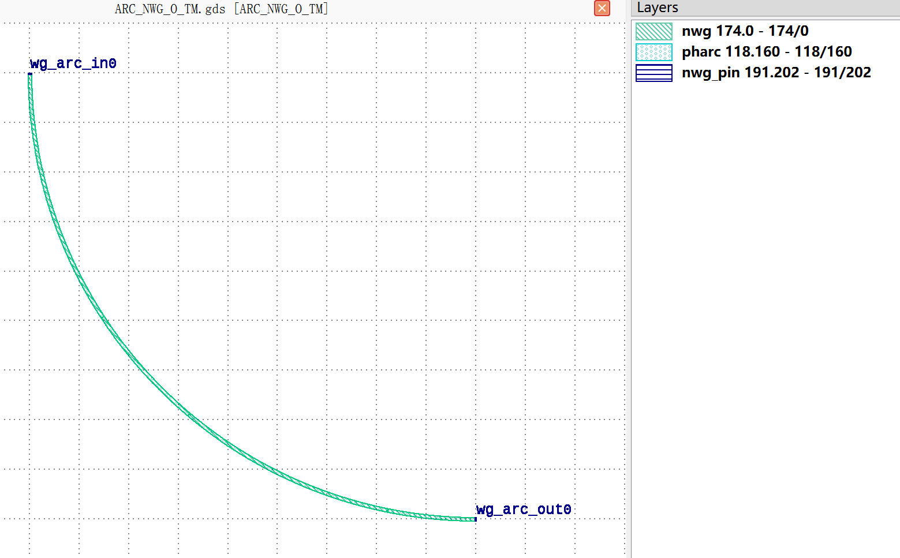

+-----------------------------+---------------------------------------------+-----------------------------+
|            ports            |                waveguide type               |         orientation         |
+=============================+=============================================+=============================+
|          wg_arc_in0         |         TECH.WG.SiN_strip.O.WIRE_TM         |              90             |
+-----------------------------+---------------------------------------------+-----------------------------+
|         wg_arc_out0         |         TECH.WG.SiN_strip.O.WIRE_TM         |              0              |
+-----------------------------+---------------------------------------------+-----------------------------+

ARC_RWG_C_TE
************
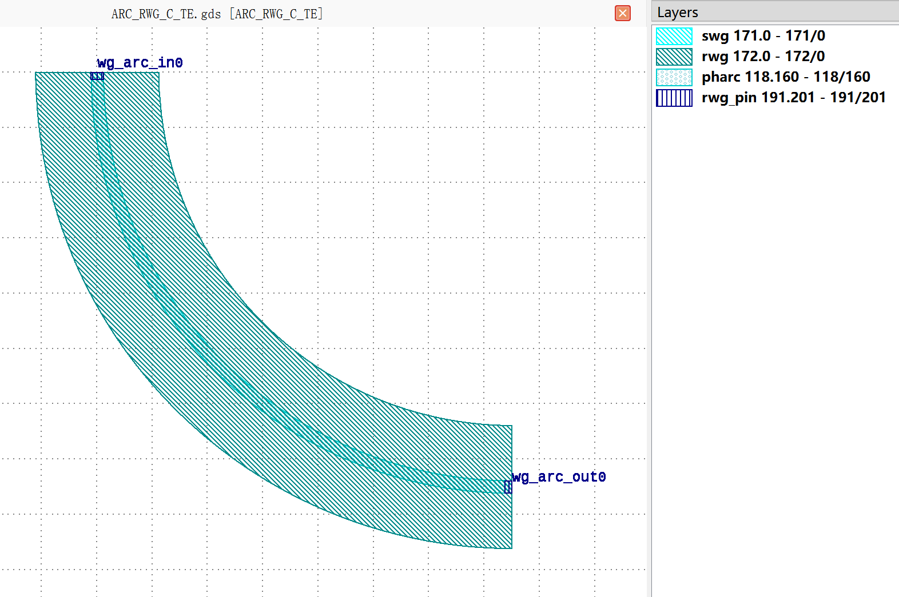

+-----------------------------+-----------------------------------------+-----------------------------+
|            ports            |              waveguide type             |         orientation         |
+=============================+=========================================+=============================+
|          wg_arc_in0         |         TECH.WG.Ridge.C.WIRE_TE         |              90             |
+-----------------------------+-----------------------------------------+-----------------------------+
|         wg_arc_out0         |         TECH.WG.Ridge.C.WIRE_TE         |              0              |
+-----------------------------+-----------------------------------------+-----------------------------+

ARC_RWG_C_TM
************
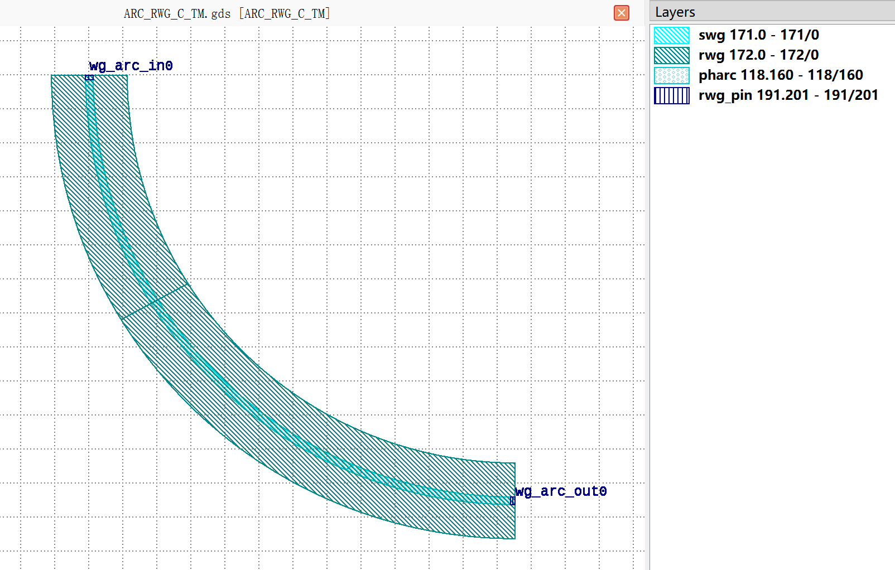

+-----------------------------+-----------------------------------------+-----------------------------+
|            ports            |              waveguide type             |         orientation         |
+=============================+=========================================+=============================+
|          wg_arc_in0         |         TECH.WG.Ridge.C.WIRE_TM         |              90             |
+-----------------------------+-----------------------------------------+-----------------------------+
|         wg_arc_out0         |         TECH.WG.Ridge.C.WIRE_TM         |              0              |
+-----------------------------+-----------------------------------------+-----------------------------+

ARC_RWG_O_TE
************
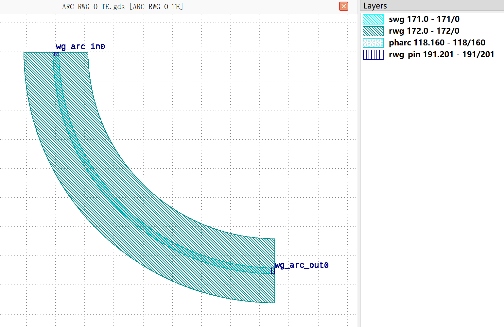

+-----------------------------+-----------------------------------------+-----------------------------+
|            ports            |              waveguide type             |         orientation         |
+=============================+=========================================+=============================+
|          wg_arc_in0         |         TECH.WG.Ridge.O.WIRE_TE         |              90             |
+-----------------------------+-----------------------------------------+-----------------------------+
|         wg_arc_out0         |         TECH.WG.Ridge.O.WIRE_TE         |              0              |
+-----------------------------+-----------------------------------------+-----------------------------+

ARC_RWG_O_TM
************
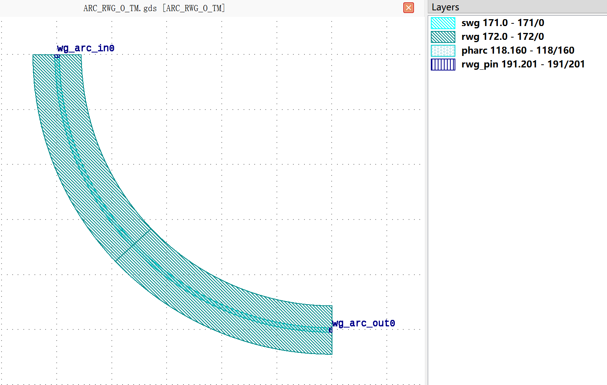

+-----------------------------+-----------------------------------------+-----------------------------+
|            ports            |              waveguide type             |         orientation         |
+=============================+=========================================+=============================+
|          wg_arc_in0         |         TECH.WG.Ridge.O.WIRE_TM         |              90             |
+-----------------------------+-----------------------------------------+-----------------------------+
|         wg_arc_out0         |         TECH.WG.Ridge.O.WIRE_TM         |              0              |
+-----------------------------+-----------------------------------------+-----------------------------+

ARC_SWG_C_TE
************
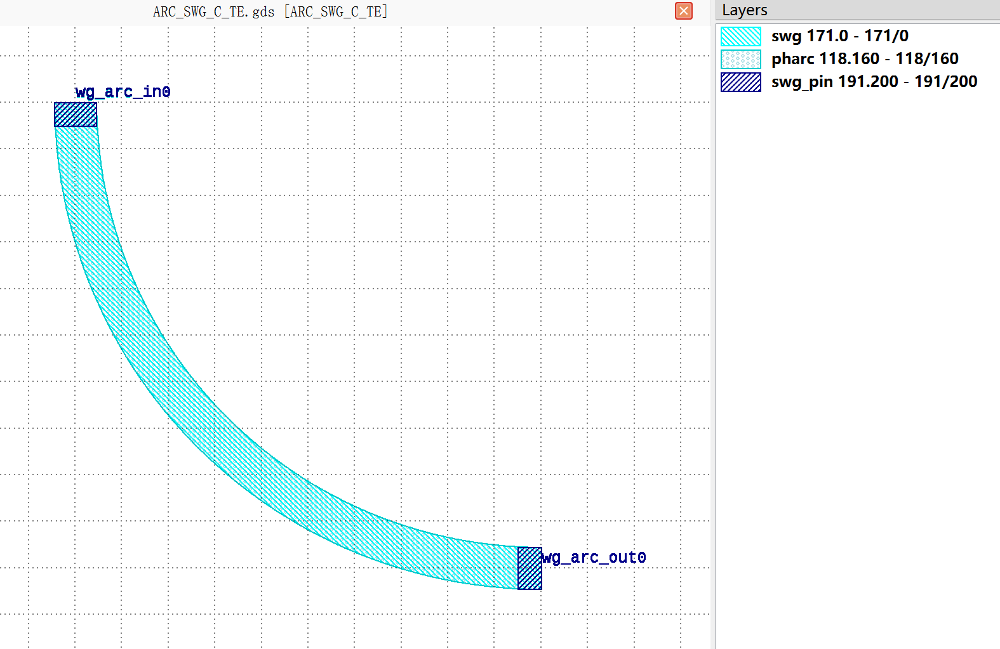

+-----------------------------+-----------------------------------------+-----------------------------+
|            ports            |              waveguide type             |         orientation         |
+=============================+=========================================+=============================+
|          wg_arc_in0         |         TECH.WG.Strip.C.WIRE_TE         |              90             |
+-----------------------------+-----------------------------------------+-----------------------------+
|         wg_arc_out0         |         TECH.WG.Strip.C.WIRE_TE         |              0              |
+-----------------------------+-----------------------------------------+-----------------------------+

ARC_SWG_C_TM
************
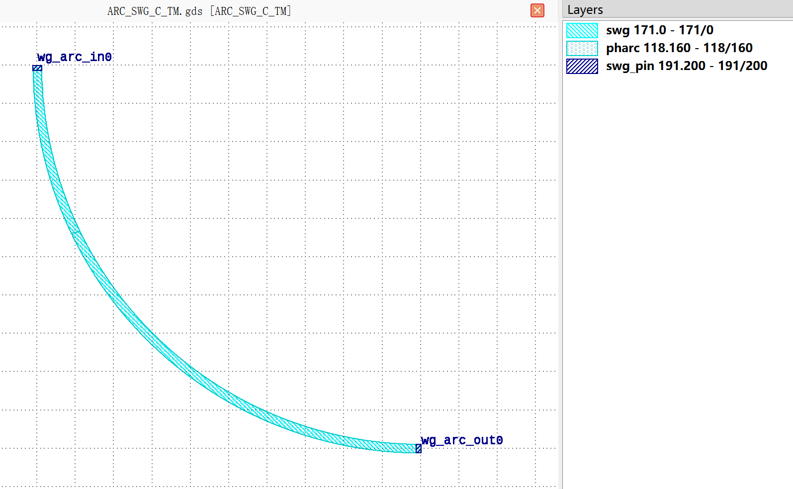

+-----------------------------+-----------------------------------------+-----------------------------+
|            ports            |              waveguide type             |         orientation         |
+=============================+=========================================+=============================+
|          wg_arc_in0         |         TECH.WG.Strip.C.WIRE_TM         |              90             |
+-----------------------------+-----------------------------------------+-----------------------------+
|         wg_arc_out0         |         TECH.WG.Strip.C.WIRE_TM         |              0              |
+-----------------------------+-----------------------------------------+-----------------------------+

ARC_SWG_O_TE
************
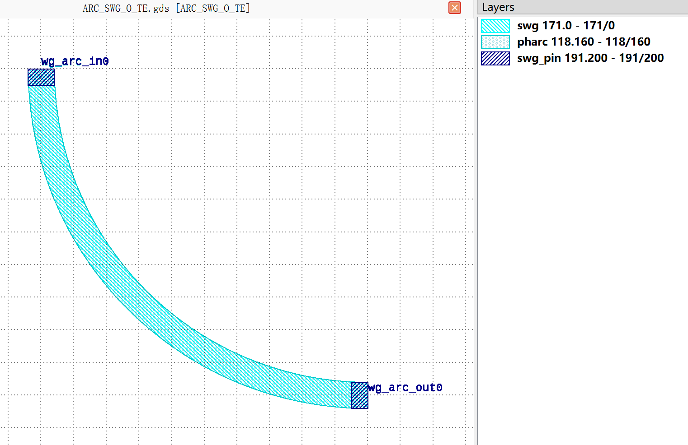

+-----------------------------+-----------------------------------------+-----------------------------+
|            ports            |              waveguide type             |         orientation         |
+=============================+=========================================+=============================+
|          wg_arc_in0         |         TECH.WG.Strip.O.WIRE_TE         |              90             |
+-----------------------------+-----------------------------------------+-----------------------------+
|         wg_arc_out0         |         TECH.WG.Strip.O.WIRE_TE         |              0              |
+-----------------------------+-----------------------------------------+-----------------------------+

ARC_SWG_O_TM
************
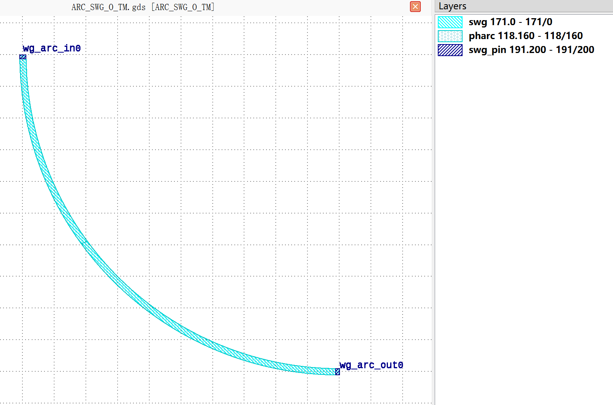

+-----------------------------+-----------------------------------------+-----------------------------+
|            ports            |              waveguide type             |         orientation         |
+=============================+=========================================+=============================+
|          wg_arc_in0         |         TECH.WG.Strip.O.WIRE_TM         |              90             |
+-----------------------------+-----------------------------------------+-----------------------------+
|         wg_arc_out0         |         TECH.WG.Strip.O.WIRE_TM         |              0              |
+-----------------------------+-----------------------------------------+-----------------------------+
