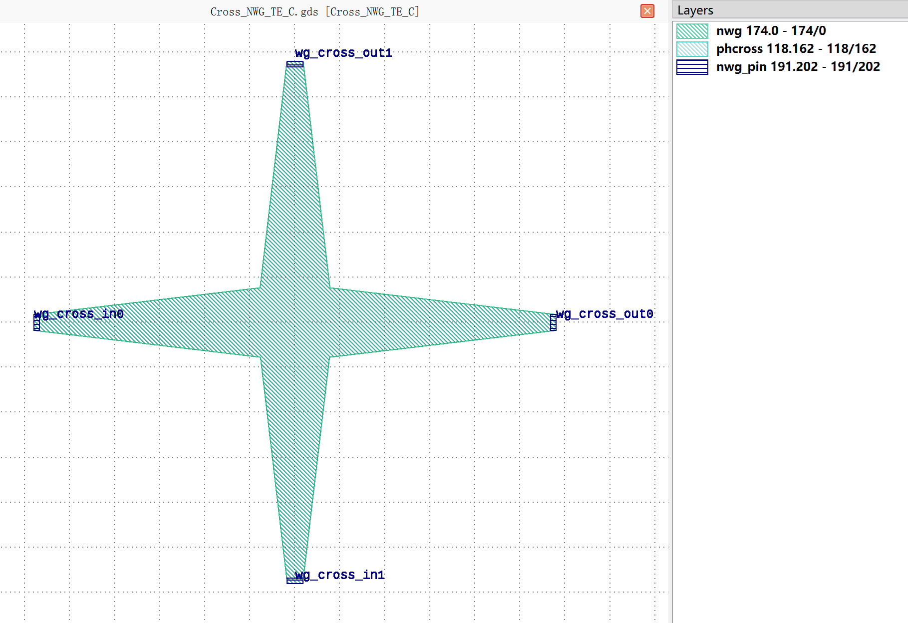
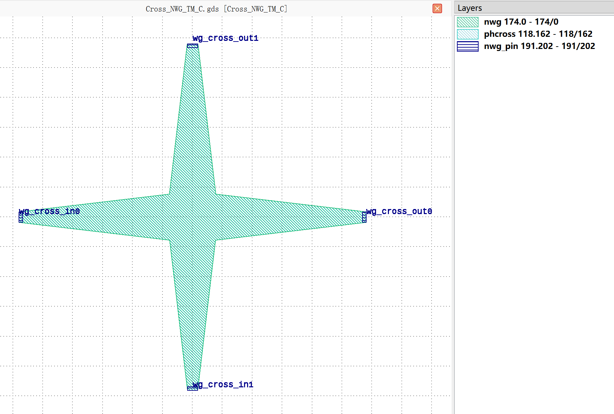
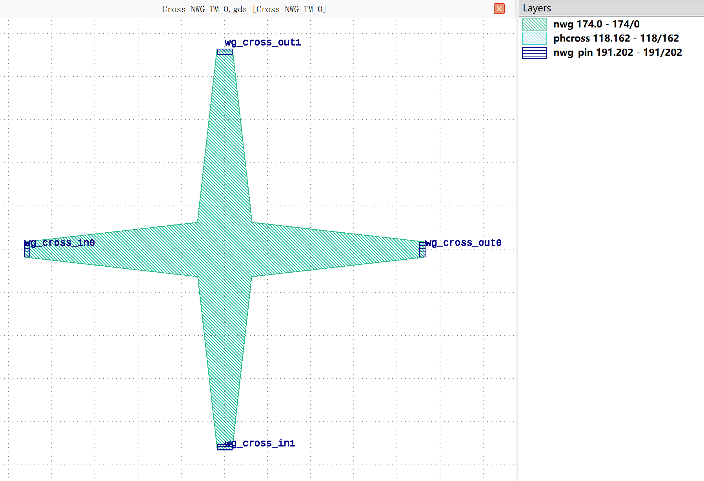
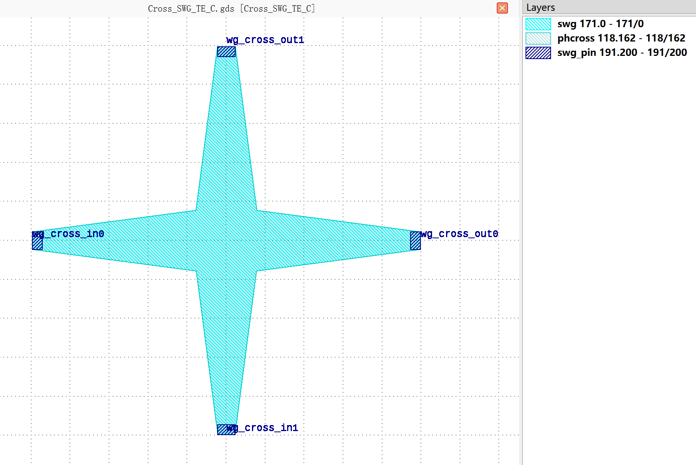
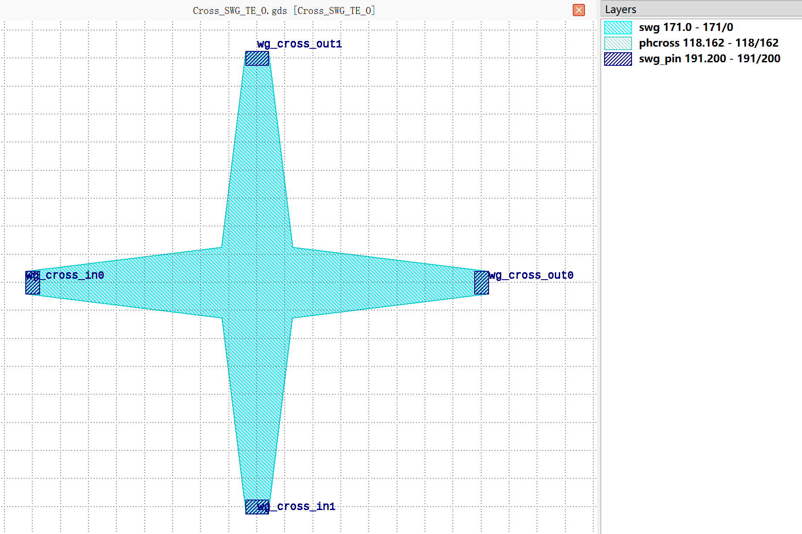
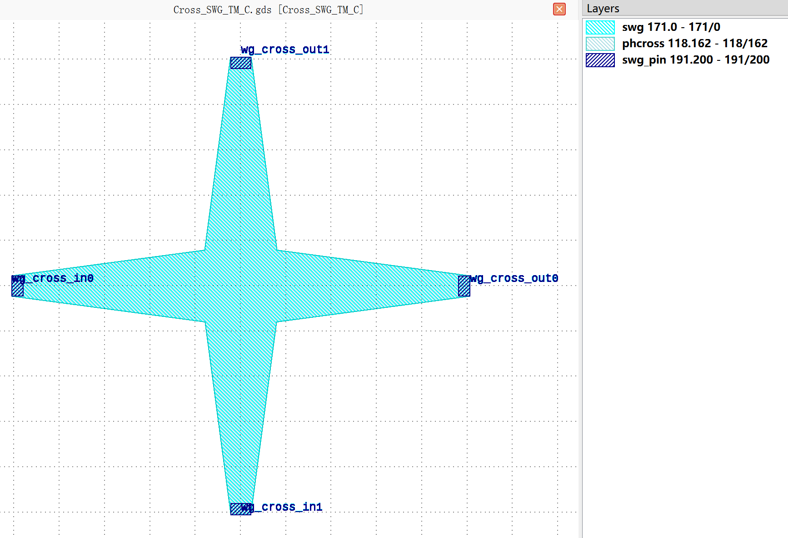
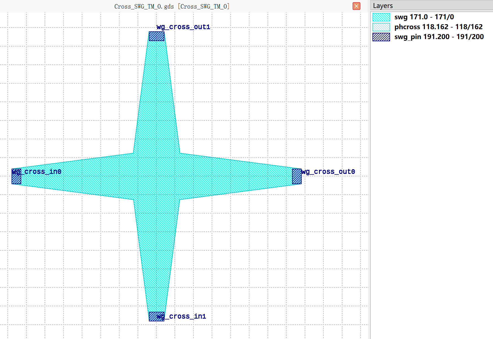

Cross
#####

Cross_NWG_TE_C
**************

+-------------------------------+---------------------------------------------+-----------------------------+
|             ports             |                waveguide type               |         orientation         |
+===============================+=============================================+=============================+
|          wg_cross_in0         |         TECH.WG.SiN_strip.C.WIRE_TE         |             180             |
+-------------------------------+---------------------------------------------+-----------------------------+
|          wg_cross_in1         |         TECH.WG.SiN_strip.C.WIRE_TE         |             270             |
+-------------------------------+---------------------------------------------+-----------------------------+
|         wg_cross_out0         |         TECH.WG.SiN_strip.C.WIRE_TE         |              0              |
+-------------------------------+---------------------------------------------+-----------------------------+
|         wg_cross_out1         |         TECH.WG.SiN_strip.C.WIRE_TE         |              90             |
+-------------------------------+---------------------------------------------+-----------------------------+

Cross_NWG_TE_O
**************

+-------------------------------+---------------------------------------------+-----------------------------+
|             ports             |                waveguide type               |         orientation         |
+===============================+=============================================+=============================+
|          wg_cross_in0         |         TECH.WG.SiN_strip.O.WIRE_TE         |             180             |
+-------------------------------+---------------------------------------------+-----------------------------+
|          wg_cross_in1         |         TECH.WG.SiN_strip.O.WIRE_TE         |             270             |
+-------------------------------+---------------------------------------------+-----------------------------+
|         wg_cross_out0         |         TECH.WG.SiN_strip.O.WIRE_TE         |              0              |
+-------------------------------+---------------------------------------------+-----------------------------+
|         wg_cross_out1         |         TECH.WG.SiN_strip.O.WIRE_TE         |              90             |
+-------------------------------+---------------------------------------------+-----------------------------+

Cross_NWG_TM_C
**************

+-------------------------------+---------------------------------------------+-----------------------------+
|             ports             |                waveguide type               |         orientation         |
+===============================+=============================================+=============================+
|          wg_cross_in0         |         TECH.WG.SiN_strip.C.WIRE_TM         |             180             |
+-------------------------------+---------------------------------------------+-----------------------------+
|          wg_cross_in1         |         TECH.WG.SiN_strip.C.WIRE_TM         |             270             |
+-------------------------------+---------------------------------------------+-----------------------------+
|         wg_cross_out0         |         TECH.WG.SiN_strip.C.WIRE_TM         |              0              |
+-------------------------------+---------------------------------------------+-----------------------------+
|         wg_cross_out1         |         TECH.WG.SiN_strip.C.WIRE_TM         |              90             |
+-------------------------------+---------------------------------------------+-----------------------------+

Cross_NWG_TM_O
**************

+-------------------------------+---------------------------------------------+-----------------------------+
|             ports             |                waveguide type               |         orientation         |
+===============================+=============================================+=============================+
|          wg_cross_in0         |         TECH.WG.SiN_strip.O.WIRE_TM         |             180             |
+-------------------------------+---------------------------------------------+-----------------------------+
|          wg_cross_in1         |         TECH.WG.SiN_strip.O.WIRE_TM         |             270             |
+-------------------------------+---------------------------------------------+-----------------------------+
|         wg_cross_out0         |         TECH.WG.SiN_strip.O.WIRE_TM         |              0              |
+-------------------------------+---------------------------------------------+-----------------------------+
|         wg_cross_out1         |         TECH.WG.SiN_strip.O.WIRE_TM         |              90             |
+-------------------------------+---------------------------------------------+-----------------------------+

Cross_SWG_TE_C
**************

+-------------------------------+-----------------------------------------+-----------------------------+
|             ports             |              waveguide type             |         orientation         |
+===============================+=========================================+=============================+
|          wg_cross_in0         |         TECH.WG.Strip.C.WIRE_TE         |             180             |
+-------------------------------+-----------------------------------------+-----------------------------+
|          wg_cross_in1         |         TECH.WG.Strip.C.WIRE_TE         |             270             |
+-------------------------------+-----------------------------------------+-----------------------------+
|         wg_cross_out0         |         TECH.WG.Strip.C.WIRE_TE         |              0              |
+-------------------------------+-----------------------------------------+-----------------------------+
|         wg_cross_out1         |         TECH.WG.Strip.C.WIRE_TE         |              90             |
+-------------------------------+-----------------------------------------+-----------------------------+

Cross_SWG_TE_O
**************

+-------------------------------+-----------------------------------------+-----------------------------+
|             ports             |              waveguide type             |         orientation         |
+===============================+=========================================+=============================+
|          wg_cross_in0         |         TECH.WG.Strip.O.WIRE_TE         |             180             |
+-------------------------------+-----------------------------------------+-----------------------------+
|          wg_cross_in1         |         TECH.WG.Strip.O.WIRE_TE         |             270             |
+-------------------------------+-----------------------------------------+-----------------------------+
|         wg_cross_out0         |         TECH.WG.Strip.O.WIRE_TE         |              0              |
+-------------------------------+-----------------------------------------+-----------------------------+
|         wg_cross_out1         |         TECH.WG.Strip.O.WIRE_TE         |              90             |
+-------------------------------+-----------------------------------------+-----------------------------+

Cross_SWG_TM_C
**************

+-------------------------------+-----------------------------------------+-----------------------------+
|             ports             |              waveguide type             |         orientation         |
+===============================+=========================================+=============================+
|          wg_cross_in0         |         TECH.WG.Strip.C.WIRE_TM         |             180             |
+-------------------------------+-----------------------------------------+-----------------------------+
|          wg_cross_in1         |         TECH.WG.Strip.C.WIRE_TM         |             270             |
+-------------------------------+-----------------------------------------+-----------------------------+
|         wg_cross_out0         |         TECH.WG.Strip.C.WIRE_TM         |              0              |
+-------------------------------+-----------------------------------------+-----------------------------+
|         wg_cross_out1         |         TECH.WG.Strip.C.WIRE_TM         |              90             |
+-------------------------------+-----------------------------------------+-----------------------------+

Cross_SWG_TM_O
**************

+-------------------------------+-----------------------------------------+-----------------------------+
|             ports             |              waveguide type             |         orientation         |
+===============================+=========================================+=============================+
|          wg_cross_in0         |         TECH.WG.Strip.O.WIRE_TM         |             180             |
+-------------------------------+-----------------------------------------+-----------------------------+
|          wg_cross_in1         |         TECH.WG.Strip.O.WIRE_TM         |             270             |
+-------------------------------+-----------------------------------------+-----------------------------+
|         wg_cross_out0         |         TECH.WG.Strip.O.WIRE_TM         |              0              |
+-------------------------------+-----------------------------------------+-----------------------------+
|         wg_cross_out1         |         TECH.WG.Strip.O.WIRE_TM         |              90             |
+-------------------------------+-----------------------------------------+-----------------------------+
