Directional Coupler (DC)
########################

DC_NWG_TE_C
***********
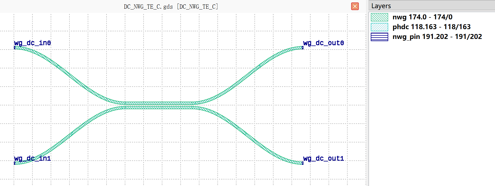

+----------------------------+---------------------------------------------+-----------------------------+
|            ports           |                waveguide type               |         orientation         |
+============================+=============================================+=============================+
|          wg_dc_in0         |         TECH.WG.SiN_strip.C.WIRE_TE         |             180             |
+----------------------------+---------------------------------------------+-----------------------------+
|          wg_dc_in1         |         TECH.WG.SiN_strip.C.WIRE_TE         |             180             |
+----------------------------+---------------------------------------------+-----------------------------+
|          wg_dc_out0        |         TECH.WG.SiN_strip.C.WIRE_TE         |              0              |
+----------------------------+---------------------------------------------+-----------------------------+
|          wg_dc_out1        |         TECH.WG.SiN_strip.C.WIRE_TE         |              0              |
+----------------------------+---------------------------------------------+-----------------------------+

DC_NWG_TE_O
***********
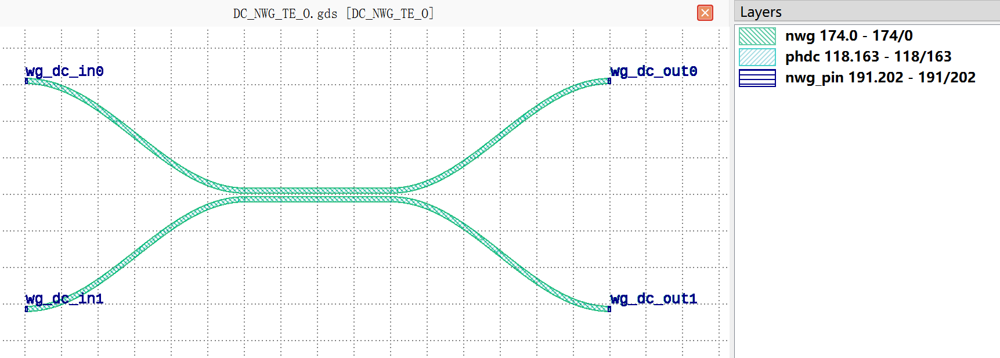

+----------------------------+---------------------------------------------+-----------------------------+
|            ports           |                waveguide type               |         orientation         |
+============================+=============================================+=============================+
|          wg_dc_in0         |         TECH.WG.SiN_strip.O.WIRE_TE         |             180             |
+----------------------------+---------------------------------------------+-----------------------------+
|          wg_dc_in1         |         TECH.WG.SiN_strip.O.WIRE_TE         |             180             |
+----------------------------+---------------------------------------------+-----------------------------+
|          wg_dc_out0        |         TECH.WG.SiN_strip.O.WIRE_TE         |              0              |
+----------------------------+---------------------------------------------+-----------------------------+
|          wg_dc_out1        |         TECH.WG.SiN_strip.O.WIRE_TE         |              0              |
+----------------------------+---------------------------------------------+-----------------------------+

DC_NWG_TM_C
***********
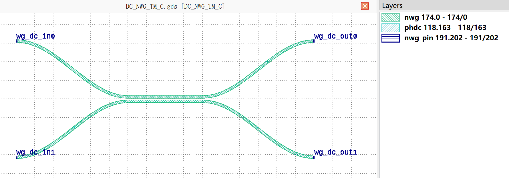

+----------------------------+---------------------------------------------+-----------------------------+
|            ports           |                waveguide type               |         orientation         |
+============================+=============================================+=============================+
|          wg_dc_in0         |         TECH.WG.SiN_strip.C.WIRE_TM         |             180             |
+----------------------------+---------------------------------------------+-----------------------------+
|          wg_dc_in1         |         TECH.WG.SiN_strip.C.WIRE_TM         |             180             |
+----------------------------+---------------------------------------------+-----------------------------+
|          wg_dc_out0        |         TECH.WG.SiN_strip.C.WIRE_TM         |              0              |
+----------------------------+---------------------------------------------+-----------------------------+
|          wg_dc_out1        |         TECH.WG.SiN_strip.C.WIRE_TM         |              0              |
+----------------------------+---------------------------------------------+-----------------------------+

DC_NWG_TM_O
***********
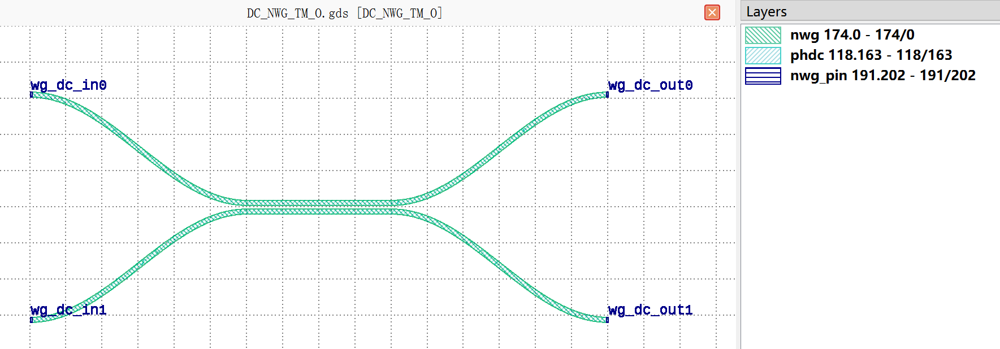

+----------------------------+---------------------------------------------+-----------------------------+
|            ports           |                waveguide type               |         orientation         |
+============================+=============================================+=============================+
|          wg_dc_in0         |         TECH.WG.SiN_strip.O.WIRE_TM         |             180             |
+----------------------------+---------------------------------------------+-----------------------------+
|          wg_dc_in1         |         TECH.WG.SiN_strip.O.WIRE_TM         |             180             |
+----------------------------+---------------------------------------------+-----------------------------+
|          wg_dc_out0        |         TECH.WG.SiN_strip.O.WIRE_TM         |              0              |
+----------------------------+---------------------------------------------+-----------------------------+
|          wg_dc_out1        |         TECH.WG.SiN_strip.O.WIRE_TM         |              0              |
+----------------------------+---------------------------------------------+-----------------------------+

DC_RWG_TE_C
***********
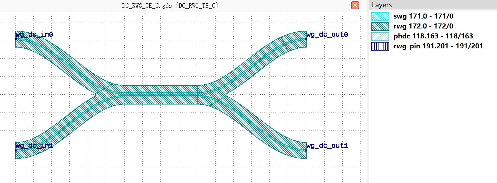

+----------------------------+-----------------------------------------+-----------------------------+
|            ports           |              waveguide type             |         orientation         |
+============================+=========================================+=============================+
|          wg_dc_in0         |         TECH.WG.Ridge.C.WIRE_TE         |             180             |
+----------------------------+-----------------------------------------+-----------------------------+
|          wg_dc_in1         |         TECH.WG.Ridge.C.WIRE_TE         |             180             |
+----------------------------+-----------------------------------------+-----------------------------+
|          wg_dc_out0        |         TECH.WG.Ridge.C.WIRE_TE         |              0              |
+----------------------------+-----------------------------------------+-----------------------------+
|          wg_dc_out1        |         TECH.WG.Ridge.C.WIRE_TE         |              0              |
+----------------------------+-----------------------------------------+-----------------------------+

DC_RWG_TE_O
***********
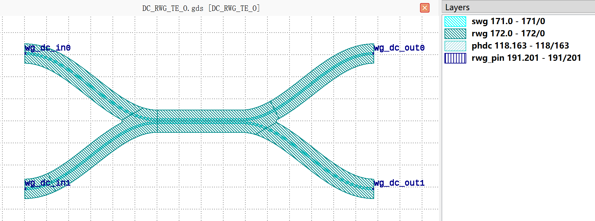

+----------------------------+-----------------------------------------+-----------------------------+
|            ports           |              waveguide type             |         orientation         |
+============================+=========================================+=============================+
|          wg_dc_in0         |         TECH.WG.Ridge.O.WIRE_TE         |             180             |
+----------------------------+-----------------------------------------+-----------------------------+
|          wg_dc_in1         |         TECH.WG.Ridge.O.WIRE_TE         |             180             |
+----------------------------+-----------------------------------------+-----------------------------+
|          wg_dc_out0        |         TECH.WG.Ridge.O.WIRE_TE         |              0              |
+----------------------------+-----------------------------------------+-----------------------------+
|          wg_dc_out1        |         TECH.WG.Ridge.O.WIRE_TE         |              0              |
+----------------------------+-----------------------------------------+-----------------------------+

DC_RWG_TM_C
***********
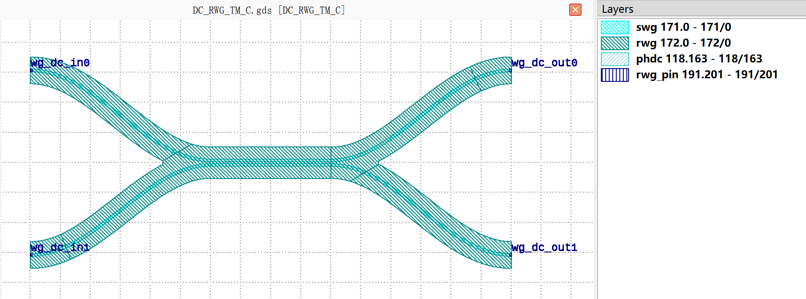

+----------------------------+-----------------------------------------+-----------------------------+
|            ports           |              waveguide type             |         orientation         |
+============================+=========================================+=============================+
|          wg_dc_in0         |         TECH.WG.Ridge.C.WIRE_TM         |             180             |
+----------------------------+-----------------------------------------+-----------------------------+
|          wg_dc_in1         |         TECH.WG.Ridge.C.WIRE_TM         |             180             |
+----------------------------+-----------------------------------------+-----------------------------+
|          wg_dc_out0        |         TECH.WG.Ridge.C.WIRE_TM         |              0              |
+----------------------------+-----------------------------------------+-----------------------------+
|          wg_dc_out1        |         TECH.WG.Ridge.C.WIRE_TM         |              0              |
+----------------------------+-----------------------------------------+-----------------------------+

DC_RWG_TM_O
***********
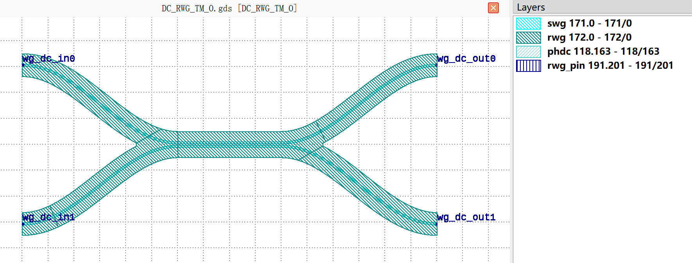

+----------------------------+-----------------------------------------+-----------------------------+
|            ports           |              waveguide type             |         orientation         |
+============================+=========================================+=============================+
|          wg_dc_in0         |         TECH.WG.Ridge.O.WIRE_TM         |             180             |
+----------------------------+-----------------------------------------+-----------------------------+
|          wg_dc_in1         |         TECH.WG.Ridge.O.WIRE_TM         |             180             |
+----------------------------+-----------------------------------------+-----------------------------+
|          wg_dc_out0        |         TECH.WG.Ridge.O.WIRE_TM         |              0              |
+----------------------------+-----------------------------------------+-----------------------------+
|          wg_dc_out1        |         TECH.WG.Ridge.O.WIRE_TM         |              0              |
+----------------------------+-----------------------------------------+-----------------------------+

DC_SWG_TE_C
***********
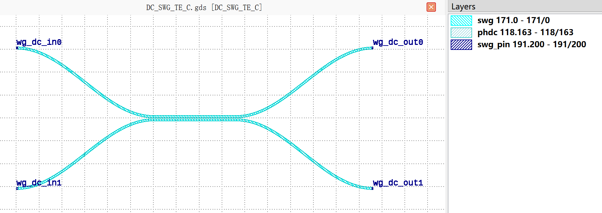

+----------------------------+-----------------------------------------+-----------------------------+
|            ports           |              waveguide type             |         orientation         |
+============================+=========================================+=============================+
|          wg_dc_in0         |         TECH.WG.Strip.C.WIRE_TE         |             180             |
+----------------------------+-----------------------------------------+-----------------------------+
|          wg_dc_in1         |         TECH.WG.Strip.C.WIRE_TE         |             180             |
+----------------------------+-----------------------------------------+-----------------------------+
|          wg_dc_out0        |         TECH.WG.Strip.C.WIRE_TE         |              0              |
+----------------------------+-----------------------------------------+-----------------------------+
|          wg_dc_out1        |         TECH.WG.Strip.C.WIRE_TE         |              0              |
+----------------------------+-----------------------------------------+-----------------------------+

DC_SWG_TE_O
***********
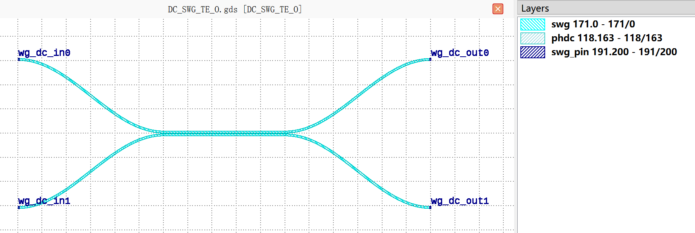

+----------------------------+-----------------------------------------+-----------------------------+
|            ports           |              waveguide type             |         orientation         |
+============================+=========================================+=============================+
|          wg_dc_in0         |         TECH.WG.Strip.O.WIRE_TE         |             180             |
+----------------------------+-----------------------------------------+-----------------------------+
|          wg_dc_in1         |         TECH.WG.Strip.O.WIRE_TE         |             180             |
+----------------------------+-----------------------------------------+-----------------------------+
|          wg_dc_out0        |         TECH.WG.Strip.O.WIRE_TE         |              0              |
+----------------------------+-----------------------------------------+-----------------------------+
|          wg_dc_out1        |         TECH.WG.Strip.O.WIRE_TE         |              0              |
+----------------------------+-----------------------------------------+-----------------------------+

DC_SWG_TM_C
***********
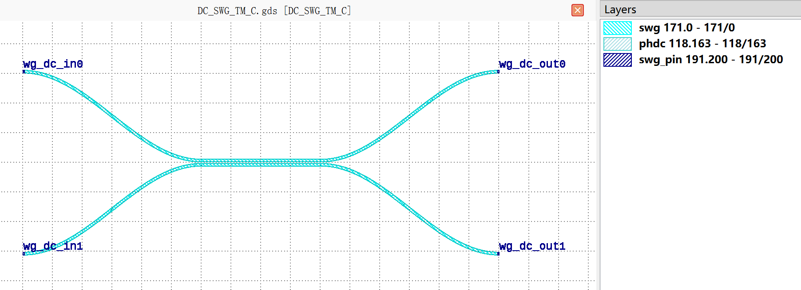

+----------------------------+-----------------------------------------+-----------------------------+
|            ports           |              waveguide type             |         orientation         |
+============================+=========================================+=============================+
|          wg_dc_in0         |         TECH.WG.Strip.C.WIRE_TM         |             180             |
+----------------------------+-----------------------------------------+-----------------------------+
|          wg_dc_in1         |         TECH.WG.Strip.C.WIRE_TM         |             180             |
+----------------------------+-----------------------------------------+-----------------------------+
|          wg_dc_out0        |         TECH.WG.Strip.C.WIRE_TM         |              0              |
+----------------------------+-----------------------------------------+-----------------------------+
|          wg_dc_out1        |         TECH.WG.Strip.C.WIRE_TM         |              0              |
+----------------------------+-----------------------------------------+-----------------------------+

DC_SWG_TM_O
***********
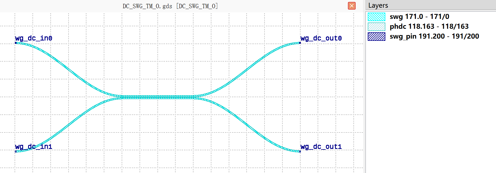

+----------------------------+-----------------------------------------+-----------------------------+
|            ports           |              waveguide type             |         orientation         |
+============================+=========================================+=============================+
|          wg_dc_in0         |         TECH.WG.Strip.O.WIRE_TM         |             180             |
+----------------------------+-----------------------------------------+-----------------------------+
|          wg_dc_in1         |         TECH.WG.Strip.O.WIRE_TM         |             180             |
+----------------------------+-----------------------------------------+-----------------------------+
|          wg_dc_out0        |         TECH.WG.Strip.O.WIRE_TM         |              0              |
+----------------------------+-----------------------------------------+-----------------------------+
|          wg_dc_out1        |         TECH.WG.Strip.O.WIRE_TM         |              0              |
+----------------------------+-----------------------------------------+-----------------------------+
