MultiMode Interferometers (MMI)
###############################

mmi1x2_NWG_TE_C
***************
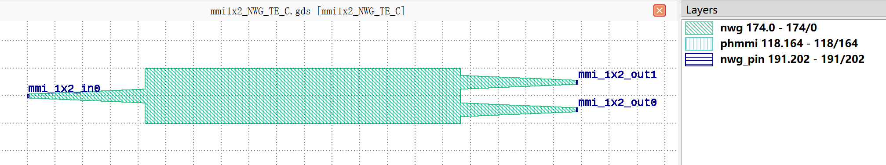

+------------------------------+---------------------------------------------+-----------------------------+
|             ports            |                waveguide type               |         orientation         |
+==============================+=============================================+=============================+
|          mmi_1x2_in0         |         TECH.WG.SiN_strip.C.WIRE_TE         |             180             |
+------------------------------+---------------------------------------------+-----------------------------+
|          mmi_1x2_out0        |         TECH.WG.SiN_strip.C.WIRE_TE         |              0              |
+------------------------------+---------------------------------------------+-----------------------------+
|          mmi_1x2_out1        |         TECH.WG.SiN_strip.C.WIRE_TE         |              0              |
+------------------------------+---------------------------------------------+-----------------------------+

mmi1x2_NWG_TE_O
***************
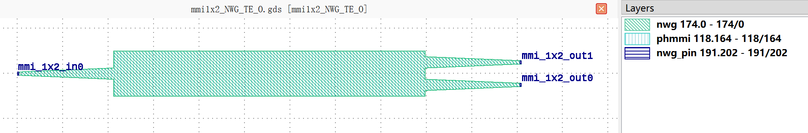

+------------------------------+---------------------------------------------+-----------------------------+
|             ports            |                waveguide type               |         orientation         |
+==============================+=============================================+=============================+
|          mmi_1x2_in0         |         TECH.WG.SiN_strip.O.WIRE_TE         |             180             |
+------------------------------+---------------------------------------------+-----------------------------+
|          mmi_1x2_out0        |         TECH.WG.SiN_strip.O.WIRE_TE         |              0              |
+------------------------------+---------------------------------------------+-----------------------------+
|          mmi_1x2_out1        |         TECH.WG.SiN_strip.O.WIRE_TE         |              0              |
+------------------------------+---------------------------------------------+-----------------------------+

mmi1x2_NWG_TM_C
***************
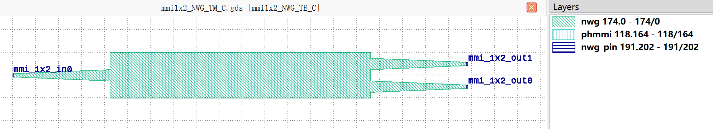

+------------------------------+---------------------------------------------+-----------------------------+
|             ports            |                waveguide type               |         orientation         |
+==============================+=============================================+=============================+
|          mmi_1x2_in0         |         TECH.WG.SiN_strip.C.WIRE_TM         |             180             |
+------------------------------+---------------------------------------------+-----------------------------+
|          mmi_1x2_out0        |         TECH.WG.SiN_strip.C.WIRE_TM         |              0              |
+------------------------------+---------------------------------------------+-----------------------------+
|          mmi_1x2_out1        |         TECH.WG.SiN_strip.C.WIRE_TM         |              0              |
+------------------------------+---------------------------------------------+-----------------------------+

mmi1x2_NWG_TM_O
***************
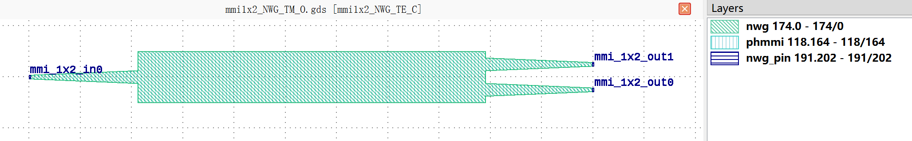

+------------------------------+---------------------------------------------+-----------------------------+
|             ports            |                waveguide type               |         orientation         |
+==============================+=============================================+=============================+
|          mmi_1x2_in0         |         TECH.WG.SiN_strip.O.WIRE_TM         |             180             |
+------------------------------+---------------------------------------------+-----------------------------+
|          mmi_1x2_out0        |         TECH.WG.SiN_strip.O.WIRE_TM         |              0              |
+------------------------------+---------------------------------------------+-----------------------------+
|          mmi_1x2_out1        |         TECH.WG.SiN_strip.O.WIRE_TM         |              0              |
+------------------------------+---------------------------------------------+-----------------------------+

mmi1x2_RWG_TE_C
***************
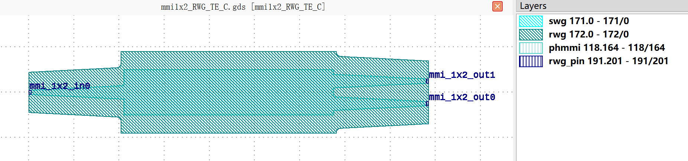

+------------------------------+-----------------------------------------+-----------------------------+
|             ports            |              waveguide type             |         orientation         |
+==============================+=========================================+=============================+
|          mmi_1x2_in0         |         TECH.WG.Ridge.C.WIRE_TE         |             180             |
+------------------------------+-----------------------------------------+-----------------------------+
|          mmi_1x2_out0        |         TECH.WG.Ridge.C.WIRE_TE         |              0              |
+------------------------------+-----------------------------------------+-----------------------------+
|          mmi_1x2_out1        |         TECH.WG.Ridge.C.WIRE_TE         |              0              |
+------------------------------+-----------------------------------------+-----------------------------+

mmi1x2_RWG_TE_O
***************
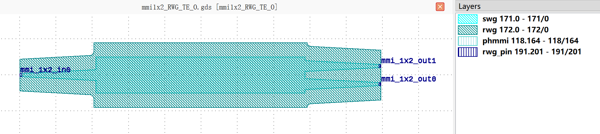

+------------------------------+-----------------------------------------+-----------------------------+
|             ports            |              waveguide type             |         orientation         |
+==============================+=========================================+=============================+
|          mmi_1x2_in0         |         TECH.WG.Ridge.O.WIRE_TE         |             180             |
+------------------------------+-----------------------------------------+-----------------------------+
|          mmi_1x2_out0        |         TECH.WG.Ridge.O.WIRE_TE         |              0              |
+------------------------------+-----------------------------------------+-----------------------------+
|          mmi_1x2_out1        |         TECH.WG.Ridge.O.WIRE_TE         |              0              |
+------------------------------+-----------------------------------------+-----------------------------+

mmi1x2_RWG_TM_O
***************
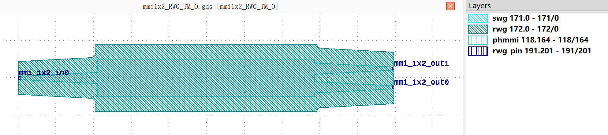

+------------------------------+-----------------------------------------+-----------------------------+
|             ports            |              waveguide type             |         orientation         |
+==============================+=========================================+=============================+
|          mmi_1x2_in0         |         TECH.WG.Ridge.O.WIRE_TM         |             180             |
+------------------------------+-----------------------------------------+-----------------------------+
|          mmi_1x2_out0        |         TECH.WG.Ridge.O.WIRE_TM         |              0              |
+------------------------------+-----------------------------------------+-----------------------------+
|          mmi_1x2_out1        |         TECH.WG.Ridge.O.WIRE_TM         |              0              |
+------------------------------+-----------------------------------------+-----------------------------+

mmi1x2_SWG_TE_C
***************
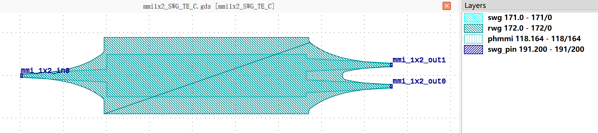

+------------------------------+-----------------------------------------+-----------------------------+
|             ports            |              waveguide type             |         orientation         |
+==============================+=========================================+=============================+
|          mmi_1x2_in0         |         TECH.WG.Strip.C.WIRE_TE         |             180             |
+------------------------------+-----------------------------------------+-----------------------------+
|          mmi_1x2_out0        |         TECH.WG.Strip.C.WIRE_TE         |              0              |
+------------------------------+-----------------------------------------+-----------------------------+
|          mmi_1x2_out1        |         TECH.WG.Strip.C.WIRE_TE         |              0              |
+------------------------------+-----------------------------------------+-----------------------------+

mmi1x2_SWG_TE_O
***************
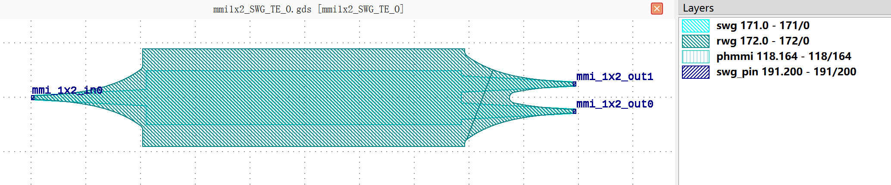

+------------------------------+-----------------------------------------+-----------------------------+
|             ports            |              waveguide type             |         orientation         |
+==============================+=========================================+=============================+
|          mmi_1x2_in0         |         TECH.WG.Strip.O.WIRE_TE         |             180             |
+------------------------------+-----------------------------------------+-----------------------------+
|          mmi_1x2_out0        |         TECH.WG.Strip.O.WIRE_TE         |              0              |
+------------------------------+-----------------------------------------+-----------------------------+
|          mmi_1x2_out1        |         TECH.WG.Strip.O.WIRE_TE         |              0              |
+------------------------------+-----------------------------------------+-----------------------------+

mmi1x2_SWG_TM_C
***************
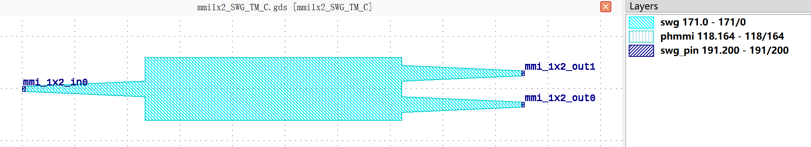

+------------------------------+-----------------------------------------+-----------------------------+
|             ports            |              waveguide type             |         orientation         |
+==============================+=========================================+=============================+
|          mmi_1x2_in0         |         TECH.WG.Strip.C.WIRE_TM         |             180             |
+------------------------------+-----------------------------------------+-----------------------------+
|          mmi_1x2_out0        |         TECH.WG.Strip.C.WIRE_TM         |              0              |
+------------------------------+-----------------------------------------+-----------------------------+
|          mmi_1x2_out1        |         TECH.WG.Strip.C.WIRE_TM         |              0              |
+------------------------------+-----------------------------------------+-----------------------------+

mmi1x2_SWG_TM_O
***************
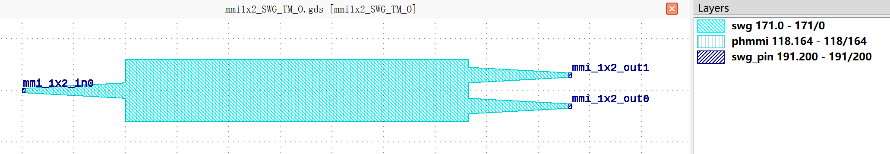

+------------------------------+-----------------------------------------+-----------------------------+
|             ports            |              waveguide type             |         orientation         |
+==============================+=========================================+=============================+
|          mmi_1x2_in0         |         TECH.WG.Strip.O.WIRE_TM         |             180             |
+------------------------------+-----------------------------------------+-----------------------------+
|          mmi_1x2_out0        |         TECH.WG.Strip.O.WIRE_TM         |              0              |
+------------------------------+-----------------------------------------+-----------------------------+
|          mmi_1x2_out1        |         TECH.WG.Strip.O.WIRE_TM         |              0              |
+------------------------------+-----------------------------------------+-----------------------------+

mmi1x4_NWG_TE_C
***************
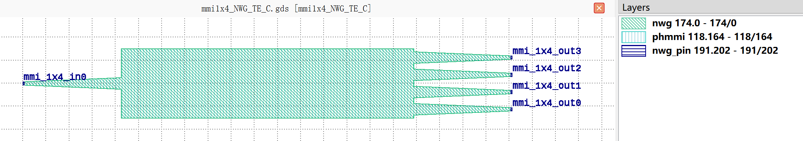

+------------------------------+---------------------------------------------+-----------------------------+
|             ports            |                waveguide type               |         orientation         |
+==============================+=============================================+=============================+
|          mmi_1x4_in0         |         TECH.WG.SiN_strip.C.WIRE_TE         |             180             |
+------------------------------+---------------------------------------------+-----------------------------+
|          mmi_1x4_out0        |         TECH.WG.SiN_strip.C.WIRE_TE         |              0              |
+------------------------------+---------------------------------------------+-----------------------------+
|          mmi_1x4_out1        |         TECH.WG.SiN_strip.C.WIRE_TE         |              0              |
+------------------------------+---------------------------------------------+-----------------------------+
|          mmi_1x4_out2        |         TECH.WG.SiN_strip.C.WIRE_TE         |              0              |
+------------------------------+---------------------------------------------+-----------------------------+
|          mmi_1x4_out3        |         TECH.WG.SiN_strip.C.WIRE_TE         |              0              |
+------------------------------+---------------------------------------------+-----------------------------+

mmi1x4_NWG_TE_O
***************
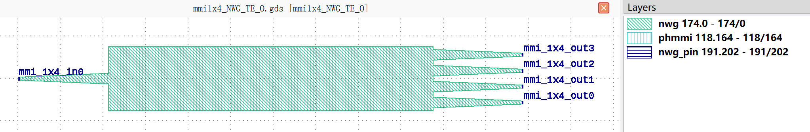

+------------------------------+---------------------------------------------+-----------------------------+
|             ports            |                waveguide type               |         orientation         |
+==============================+=============================================+=============================+
|          mmi_1x4_in0         |         TECH.WG.SiN_strip.O.WIRE_TE         |             180             |
+------------------------------+---------------------------------------------+-----------------------------+
|          mmi_1x4_out0        |         TECH.WG.SiN_strip.O.WIRE_TE         |              0              |
+------------------------------+---------------------------------------------+-----------------------------+
|          mmi_1x4_out1        |         TECH.WG.SiN_strip.O.WIRE_TE         |              0              |
+------------------------------+---------------------------------------------+-----------------------------+
|          mmi_1x4_out2        |         TECH.WG.SiN_strip.O.WIRE_TE         |              0              |
+------------------------------+---------------------------------------------+-----------------------------+
|          mmi_1x4_out3        |         TECH.WG.SiN_strip.O.WIRE_TE         |              0              |
+------------------------------+---------------------------------------------+-----------------------------+

mmi1x4_NWG_TM_C
***************
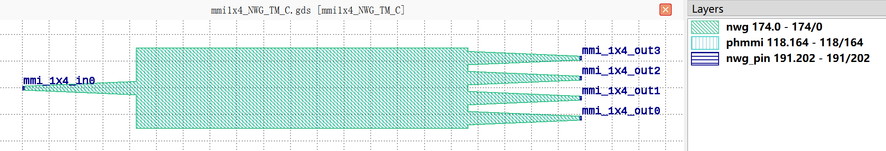

+------------------------------+---------------------------------------------+-----------------------------+
|             ports            |                waveguide type               |         orientation         |
+==============================+=============================================+=============================+
|          mmi_1x4_in0         |         TECH.WG.SiN_strip.C.WIRE_TM         |             180             |
+------------------------------+---------------------------------------------+-----------------------------+
|          mmi_1x4_out0        |         TECH.WG.SiN_strip.C.WIRE_TM         |              0              |
+------------------------------+---------------------------------------------+-----------------------------+
|          mmi_1x4_out1        |         TECH.WG.SiN_strip.C.WIRE_TM         |              0              |
+------------------------------+---------------------------------------------+-----------------------------+
|          mmi_1x4_out2        |         TECH.WG.SiN_strip.C.WIRE_TM         |              0              |
+------------------------------+---------------------------------------------+-----------------------------+
|          mmi_1x4_out3        |         TECH.WG.SiN_strip.C.WIRE_TM         |              0              |
+------------------------------+---------------------------------------------+-----------------------------+

mmi1x4_NWG_TM_O
***************
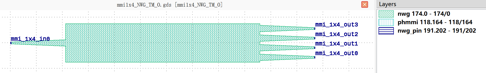

+------------------------------+---------------------------------------------+-----------------------------+
|             ports            |                waveguide type               |         orientation         |
+==============================+=============================================+=============================+
|          mmi_1x4_in0         |         TECH.WG.SiN_strip.O.WIRE_TM         |             180             |
+------------------------------+---------------------------------------------+-----------------------------+
|          mmi_1x4_out0        |         TECH.WG.SiN_strip.O.WIRE_TM         |              0              |
+------------------------------+---------------------------------------------+-----------------------------+
|          mmi_1x4_out1        |         TECH.WG.SiN_strip.O.WIRE_TM         |              0              |
+------------------------------+---------------------------------------------+-----------------------------+
|          mmi_1x4_out2        |         TECH.WG.SiN_strip.O.WIRE_TM         |              0              |
+------------------------------+---------------------------------------------+-----------------------------+
|          mmi_1x4_out3        |         TECH.WG.SiN_strip.O.WIRE_TM         |              0              |
+------------------------------+---------------------------------------------+-----------------------------+

mmi1x4_RWG_TE_C
***************
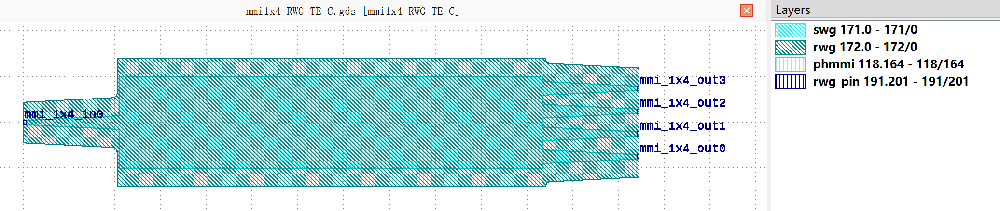

+------------------------------+-----------------------------------------+-----------------------------+
|             ports            |              waveguide type             |         orientation         |
+==============================+=========================================+=============================+
|          mmi_1x4_in0         |         TECH.WG.Ridge.C.WIRE_TE         |             180             |
+------------------------------+-----------------------------------------+-----------------------------+
|          mmi_1x4_out0        |         TECH.WG.Ridge.C.WIRE_TE         |              0              |
+------------------------------+-----------------------------------------+-----------------------------+
|          mmi_1x4_out1        |         TECH.WG.Ridge.C.WIRE_TE         |              0              |
+------------------------------+-----------------------------------------+-----------------------------+
|          mmi_1x4_out2        |         TECH.WG.Ridge.C.WIRE_TE         |              0              |
+------------------------------+-----------------------------------------+-----------------------------+
|          mmi_1x4_out3        |         TECH.WG.Ridge.C.WIRE_TE         |              0              |
+------------------------------+-----------------------------------------+-----------------------------+

mmi1x4_RWG_TE_O
***************
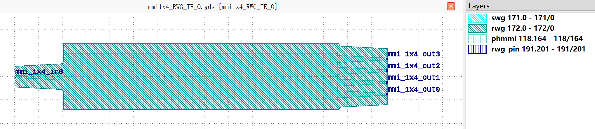

+------------------------------+-----------------------------------------+-----------------------------+
|             ports            |              waveguide type             |         orientation         |
+==============================+=========================================+=============================+
|          mmi_1x4_in0         |         TECH.WG.Ridge.O.WIRE_TE         |             180             |
+------------------------------+-----------------------------------------+-----------------------------+
|          mmi_1x4_out0        |         TECH.WG.Ridge.O.WIRE_TE         |              0              |
+------------------------------+-----------------------------------------+-----------------------------+
|          mmi_1x4_out1        |         TECH.WG.Ridge.O.WIRE_TE         |              0              |
+------------------------------+-----------------------------------------+-----------------------------+
|          mmi_1x4_out2        |         TECH.WG.Ridge.O.WIRE_TE         |              0              |
+------------------------------+-----------------------------------------+-----------------------------+
|          mmi_1x4_out3        |         TECH.WG.Ridge.O.WIRE_TE         |              0              |
+------------------------------+-----------------------------------------+-----------------------------+

mmi1x4_RWG_TM_O
***************
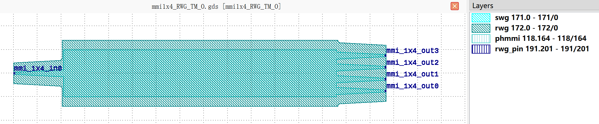

+------------------------------+-----------------------------------------+-----------------------------+
|             ports            |              waveguide type             |         orientation         |
+==============================+=========================================+=============================+
|          mmi_1x4_in0         |         TECH.WG.Ridge.O.WIRE_TM         |             180             |
+------------------------------+-----------------------------------------+-----------------------------+
|          mmi_1x4_out0        |         TECH.WG.Ridge.O.WIRE_TM         |              0              |
+------------------------------+-----------------------------------------+-----------------------------+
|          mmi_1x4_out1        |         TECH.WG.Ridge.O.WIRE_TM         |              0              |
+------------------------------+-----------------------------------------+-----------------------------+
|          mmi_1x4_out2        |         TECH.WG.Ridge.O.WIRE_TM         |              0              |
+------------------------------+-----------------------------------------+-----------------------------+
|          mmi_1x4_out3        |         TECH.WG.Ridge.O.WIRE_TM         |              0              |
+------------------------------+-----------------------------------------+-----------------------------+

mmi1x4_SWG_TE_C
***************
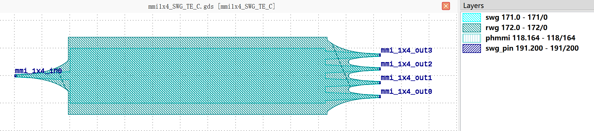

+------------------------------+-----------------------------------------+-----------------------------+
|             ports            |              waveguide type             |         orientation         |
+==============================+=========================================+=============================+
|          mmi_1x4_in0         |         TECH.WG.Strip.C.WIRE_TE         |             180             |
+------------------------------+-----------------------------------------+-----------------------------+
|          mmi_1x4_out0        |         TECH.WG.Strip.C.WIRE_TE         |              0              |
+------------------------------+-----------------------------------------+-----------------------------+
|          mmi_1x4_out1        |         TECH.WG.Strip.C.WIRE_TE         |              0              |
+------------------------------+-----------------------------------------+-----------------------------+
|          mmi_1x4_out2        |         TECH.WG.Strip.C.WIRE_TE         |              0              |
+------------------------------+-----------------------------------------+-----------------------------+
|          mmi_1x4_out3        |         TECH.WG.Strip.C.WIRE_TE         |              0              |
+------------------------------+-----------------------------------------+-----------------------------+

mmi1x4_SWG_TE_O
***************
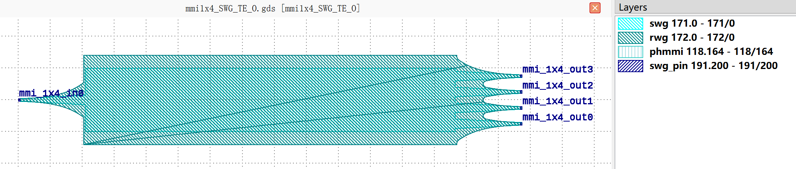

+------------------------------+-----------------------------------------+-----------------------------+
|             ports            |              waveguide type             |         orientation         |
+==============================+=========================================+=============================+
|          mmi_1x4_in0         |         TECH.WG.Strip.O.WIRE_TE         |             180             |
+------------------------------+-----------------------------------------+-----------------------------+
|          mmi_1x4_out0        |         TECH.WG.Strip.O.WIRE_TE         |              0              |
+------------------------------+-----------------------------------------+-----------------------------+
|          mmi_1x4_out1        |         TECH.WG.Strip.O.WIRE_TE         |              0              |
+------------------------------+-----------------------------------------+-----------------------------+
|          mmi_1x4_out2        |         TECH.WG.Strip.O.WIRE_TE         |              0              |
+------------------------------+-----------------------------------------+-----------------------------+
|          mmi_1x4_out3        |         TECH.WG.Strip.O.WIRE_TE         |              0              |
+------------------------------+-----------------------------------------+-----------------------------+

mmi1x4_SWG_TM_C
***************
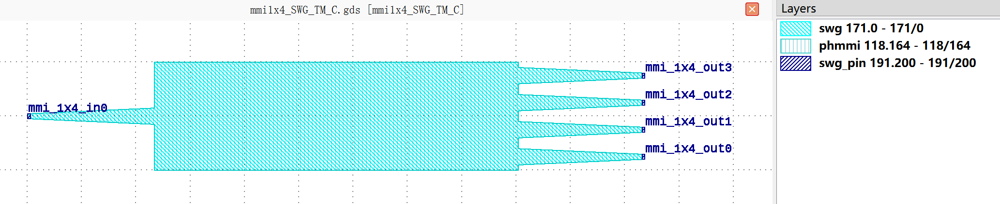

+------------------------------+-----------------------------------------+-----------------------------+
|             ports            |              waveguide type             |         orientation         |
+==============================+=========================================+=============================+
|          mmi_1x4_in0         |         TECH.WG.Strip.C.WIRE_TM         |             180             |
+------------------------------+-----------------------------------------+-----------------------------+
|          mmi_1x4_out0        |         TECH.WG.Strip.C.WIRE_TM         |              0              |
+------------------------------+-----------------------------------------+-----------------------------+
|          mmi_1x4_out1        |         TECH.WG.Strip.C.WIRE_TM         |              0              |
+------------------------------+-----------------------------------------+-----------------------------+
|          mmi_1x4_out2        |         TECH.WG.Strip.C.WIRE_TM         |              0              |
+------------------------------+-----------------------------------------+-----------------------------+
|          mmi_1x4_out3        |         TECH.WG.Strip.C.WIRE_TM         |              0              |
+------------------------------+-----------------------------------------+-----------------------------+

mmi1x4_SWG_TM_O
***************
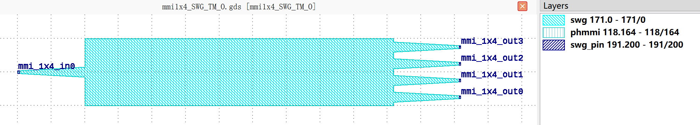

+------------------------------+-----------------------------------------+-----------------------------+
|             ports            |              waveguide type             |         orientation         |
+==============================+=========================================+=============================+
|          mmi_1x4_in0         |         TECH.WG.Strip.O.WIRE_TM         |             180             |
+------------------------------+-----------------------------------------+-----------------------------+
|          mmi_1x4_out0        |         TECH.WG.Strip.O.WIRE_TM         |              0              |
+------------------------------+-----------------------------------------+-----------------------------+
|          mmi_1x4_out1        |         TECH.WG.Strip.O.WIRE_TM         |              0              |
+------------------------------+-----------------------------------------+-----------------------------+
|          mmi_1x4_out2        |         TECH.WG.Strip.O.WIRE_TM         |              0              |
+------------------------------+-----------------------------------------+-----------------------------+
|          mmi_1x4_out3        |         TECH.WG.Strip.O.WIRE_TM         |              0              |
+------------------------------+-----------------------------------------+-----------------------------+

mmi2x2_NWG_TE_C
***************
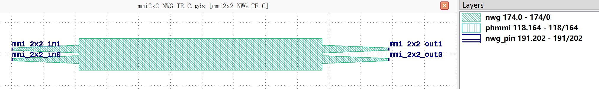

+------------------------------+---------------------------------------------+-----------------------------+
|             ports            |                waveguide type               |         orientation         |
+==============================+=============================================+=============================+
|          mmi_2x2_in0         |         TECH.WG.SiN_strip.C.WIRE_TE         |             180             |
+------------------------------+---------------------------------------------+-----------------------------+
|          mmi_2x2_in1         |         TECH.WG.SiN_strip.C.WIRE_TE         |             180             |
+------------------------------+---------------------------------------------+-----------------------------+
|          mmi_2x2_out0        |         TECH.WG.SiN_strip.C.WIRE_TE         |              0              |
+------------------------------+---------------------------------------------+-----------------------------+
|          mmi_2x2_out1        |         TECH.WG.SiN_strip.C.WIRE_TE         |              0              |
+------------------------------+---------------------------------------------+-----------------------------+

mmi2x2_NWG_TE_O
***************
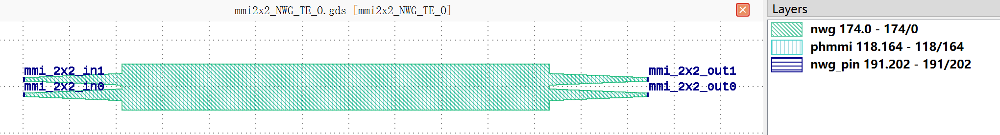

+------------------------------+---------------------------------------------+-----------------------------+
|             ports            |                waveguide type               |         orientation         |
+==============================+=============================================+=============================+
|          mmi_2x2_in0         |         TECH.WG.SiN_strip.O.WIRE_TE         |             180             |
+------------------------------+---------------------------------------------+-----------------------------+
|          mmi_2x2_in1         |         TECH.WG.SiN_strip.O.WIRE_TE         |             180             |
+------------------------------+---------------------------------------------+-----------------------------+
|          mmi_2x2_out0        |         TECH.WG.SiN_strip.O.WIRE_TE         |              0              |
+------------------------------+---------------------------------------------+-----------------------------+
|          mmi_2x2_out1        |         TECH.WG.SiN_strip.O.WIRE_TE         |              0              |
+------------------------------+---------------------------------------------+-----------------------------+

mmi2x2_NWG_TM_C
***************
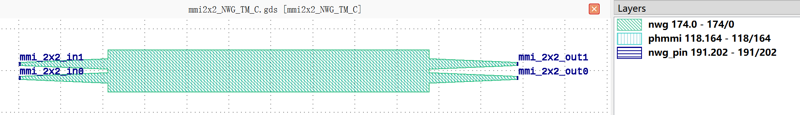

+------------------------------+---------------------------------------------+-----------------------------+
|             ports            |                waveguide type               |         orientation         |
+==============================+=============================================+=============================+
|          mmi_2x2_in0         |         TECH.WG.SiN_strip.C.WIRE_TM         |             180             |
+------------------------------+---------------------------------------------+-----------------------------+
|          mmi_2x2_in1         |         TECH.WG.SiN_strip.C.WIRE_TM         |             180             |
+------------------------------+---------------------------------------------+-----------------------------+
|          mmi_2x2_out0        |         TECH.WG.SiN_strip.C.WIRE_TM         |              0              |
+------------------------------+---------------------------------------------+-----------------------------+
|          mmi_2x2_out1        |         TECH.WG.SiN_strip.C.WIRE_TM         |              0              |
+------------------------------+---------------------------------------------+-----------------------------+

mmi2x2_NWG_TM_O
***************
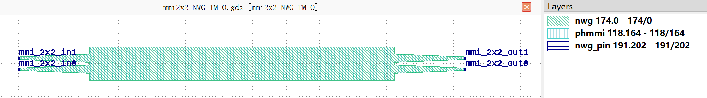

+------------------------------+---------------------------------------------+-----------------------------+
|             ports            |                waveguide type               |         orientation         |
+==============================+=============================================+=============================+
|          mmi_2x2_in0         |         TECH.WG.SiN_strip.O.WIRE_TM         |             180             |
+------------------------------+---------------------------------------------+-----------------------------+
|          mmi_2x2_in1         |         TECH.WG.SiN_strip.O.WIRE_TM         |             180             |
+------------------------------+---------------------------------------------+-----------------------------+
|          mmi_2x2_out0        |         TECH.WG.SiN_strip.O.WIRE_TM         |              0              |
+------------------------------+---------------------------------------------+-----------------------------+
|          mmi_2x2_out1        |         TECH.WG.SiN_strip.O.WIRE_TM         |              0              |
+------------------------------+---------------------------------------------+-----------------------------+

mmi2x2_RWG_TE_C
***************
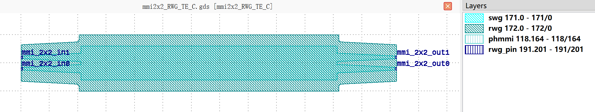

+------------------------------+-----------------------------------------+-----------------------------+
|             ports            |              waveguide type             |         orientation         |
+==============================+=========================================+=============================+
|          mmi_2x2_in0         |         TECH.WG.Ridge.C.WIRE_TE         |             180             |
+------------------------------+-----------------------------------------+-----------------------------+
|          mmi_2x2_in1         |         TECH.WG.Ridge.C.WIRE_TE         |             180             |
+------------------------------+-----------------------------------------+-----------------------------+
|          mmi_2x2_out0        |         TECH.WG.Ridge.C.WIRE_TE         |              0              |
+------------------------------+-----------------------------------------+-----------------------------+
|          mmi_2x2_out1        |         TECH.WG.Ridge.C.WIRE_TE         |              0              |
+------------------------------+-----------------------------------------+-----------------------------+

mmi2x2_RWG_TE_O
***************
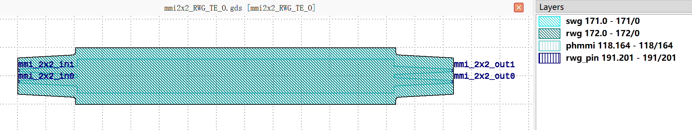

+------------------------------+-----------------------------------------+-----------------------------+
|             ports            |              waveguide type             |         orientation         |
+==============================+=========================================+=============================+
|          mmi_2x2_in0         |         TECH.WG.Ridge.O.WIRE_TE         |             180             |
+------------------------------+-----------------------------------------+-----------------------------+
|          mmi_2x2_in1         |         TECH.WG.Ridge.O.WIRE_TE         |             180             |
+------------------------------+-----------------------------------------+-----------------------------+
|          mmi_2x2_out0        |         TECH.WG.Ridge.O.WIRE_TE         |              0              |
+------------------------------+-----------------------------------------+-----------------------------+
|          mmi_2x2_out1        |         TECH.WG.Ridge.O.WIRE_TE         |              0              |
+------------------------------+-----------------------------------------+-----------------------------+

mmi2x2_RWG_TM_O
***************
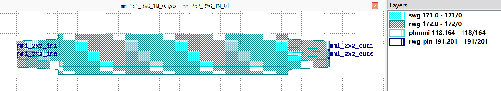

+------------------------------+-----------------------------------------+-----------------------------+
|             ports            |              waveguide type             |         orientation         |
+==============================+=========================================+=============================+
|          mmi_2x2_in0         |         TECH.WG.Ridge.O.WIRE_TM         |             180             |
+------------------------------+-----------------------------------------+-----------------------------+
|          mmi_2x2_in1         |         TECH.WG.Ridge.O.WIRE_TM         |             180             |
+------------------------------+-----------------------------------------+-----------------------------+
|          mmi_2x2_out0        |         TECH.WG.Ridge.O.WIRE_TM         |              0              |
+------------------------------+-----------------------------------------+-----------------------------+
|          mmi_2x2_out1        |         TECH.WG.Ridge.O.WIRE_TM         |              0              |
+------------------------------+-----------------------------------------+-----------------------------+

mmi2x2_SWG_TE_C
***************
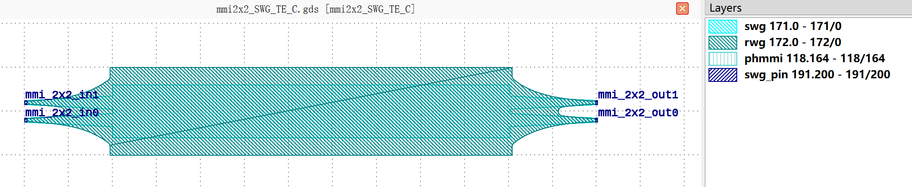

+------------------------------+-----------------------------------------+-----------------------------+
|             ports            |              waveguide type             |         orientation         |
+==============================+=========================================+=============================+
|          mmi_2x2_in0         |         TECH.WG.Strip.C.WIRE_TE         |             180             |
+------------------------------+-----------------------------------------+-----------------------------+
|          mmi_2x2_in1         |         TECH.WG.Strip.C.WIRE_TE         |             180             |
+------------------------------+-----------------------------------------+-----------------------------+
|          mmi_2x2_out0        |         TECH.WG.Strip.C.WIRE_TE         |              0              |
+------------------------------+-----------------------------------------+-----------------------------+
|          mmi_2x2_out1        |         TECH.WG.Strip.C.WIRE_TE         |              0              |
+------------------------------+-----------------------------------------+-----------------------------+

mmi2x2_SWG_TE_O
***************
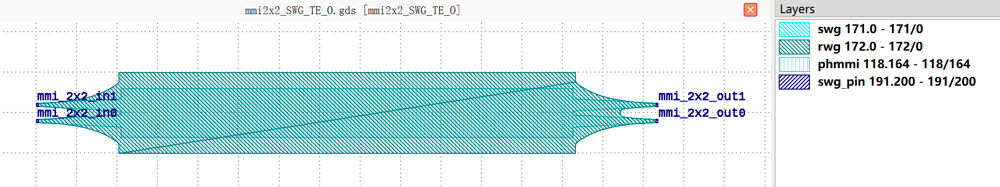

+------------------------------+-----------------------------------------+-----------------------------+
|             ports            |              waveguide type             |         orientation         |
+==============================+=========================================+=============================+
|          mmi_2x2_in0         |         TECH.WG.Strip.O.WIRE_TE         |             180             |
+------------------------------+-----------------------------------------+-----------------------------+
|          mmi_2x2_in1         |         TECH.WG.Strip.O.WIRE_TE         |             180             |
+------------------------------+-----------------------------------------+-----------------------------+
|          mmi_2x2_out0        |         TECH.WG.Strip.O.WIRE_TE         |              0              |
+------------------------------+-----------------------------------------+-----------------------------+
|          mmi_2x2_out1        |         TECH.WG.Strip.O.WIRE_TE         |              0              |
+------------------------------+-----------------------------------------+-----------------------------+

mmi2x2_SWG_TM_C
***************
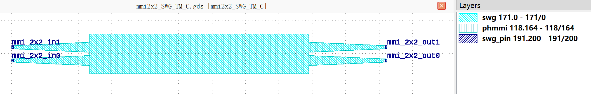

+------------------------------+-----------------------------------------+-----------------------------+
|             ports            |              waveguide type             |         orientation         |
+==============================+=========================================+=============================+
|          mmi_2x2_in0         |         TECH.WG.Strip.C.WIRE_TM         |             180             |
+------------------------------+-----------------------------------------+-----------------------------+
|          mmi_2x2_in1         |         TECH.WG.Strip.C.WIRE_TM         |             180             |
+------------------------------+-----------------------------------------+-----------------------------+
|          mmi_2x2_out0        |         TECH.WG.Strip.C.WIRE_TM         |              0              |
+------------------------------+-----------------------------------------+-----------------------------+
|          mmi_2x2_out1        |         TECH.WG.Strip.C.WIRE_TM         |              0              |
+------------------------------+-----------------------------------------+-----------------------------+

mmi2x2_SWG_TM_O
***************
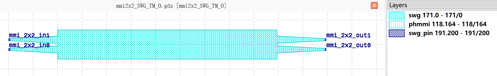

+------------------------------+-----------------------------------------+-----------------------------+
|             ports            |              waveguide type             |         orientation         |
+==============================+=========================================+=============================+
|          mmi_2x2_in0         |         TECH.WG.Strip.O.WIRE_TM         |             180             |
+------------------------------+-----------------------------------------+-----------------------------+
|          mmi_2x2_in1         |         TECH.WG.Strip.O.WIRE_TM         |             180             |
+------------------------------+-----------------------------------------+-----------------------------+
|          mmi_2x2_out0        |         TECH.WG.Strip.O.WIRE_TM         |              0              |
+------------------------------+-----------------------------------------+-----------------------------+
|          mmi_2x2_out1        |         TECH.WG.Strip.O.WIRE_TM         |              0              |
+------------------------------+-----------------------------------------+-----------------------------+
