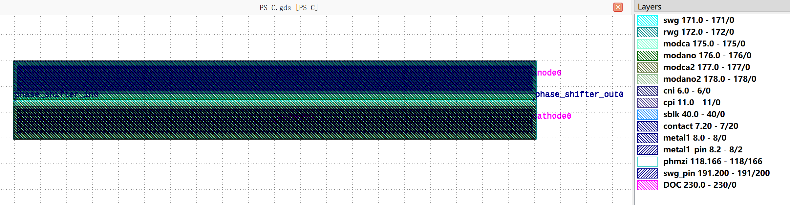
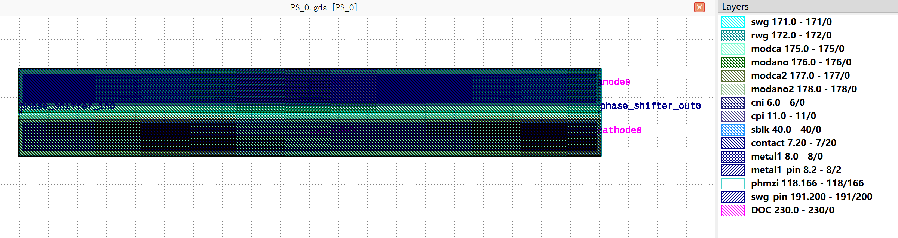

Phase Shifter
#############

PS_C
****

+------------------------------------+-----------------------------------------+-----------------------------+
|                ports               |              waveguide type             |         orientation         |
+====================================+=========================================+=============================+
|          phase_shifter_in0         |         TECH.WG.Strip.C.WIRE_TE         |             180             |
+------------------------------------+-----------------------------------------+-----------------------------+
|          phase_shifter_out0        |         TECH.WG.Strip.C.WIRE_TE         |              0              |
+------------------------------------+-----------------------------------------+-----------------------------+

+--------------------------+--------------------------------------+-----------------------------+
|           ports          |            metal line type           |         orientation         |
+==========================+======================================+=============================+
|           anode0         |          TECH.METAL.M1.W4_775        |              0              |
+--------------------------+--------------------------------------+-----------------------------+
|          cathode0        |          TECH.METAL.M1.W4_775        |              0              |
+--------------------------+--------------------------------------+-----------------------------+

PS_O
****

+------------------------------------+-----------------------------------------+-----------------------------+
|                ports               |              waveguide type             |         orientation         |
+====================================+=========================================+=============================+
|          phase_shifter_in0         |         TECH.WG.Strip.O.WIRE_TE         |             180             |
+------------------------------------+-----------------------------------------+-----------------------------+
|          phase_shifter_out0        |         TECH.WG.Strip.O.WIRE_TE         |              0              |
+------------------------------------+-----------------------------------------+-----------------------------+

+--------------------------+--------------------------------------+-----------------------------+
|           ports          |            metal line type           |         orientation         |
+==========================+======================================+=============================+
|           anode0         |          TECH.METAL.M1.W4_775        |              0              |
+--------------------------+--------------------------------------+-----------------------------+
|          cathode0        |          TECH.METAL.M1.W4_775        |              0              |
+--------------------------+--------------------------------------+-----------------------------+
