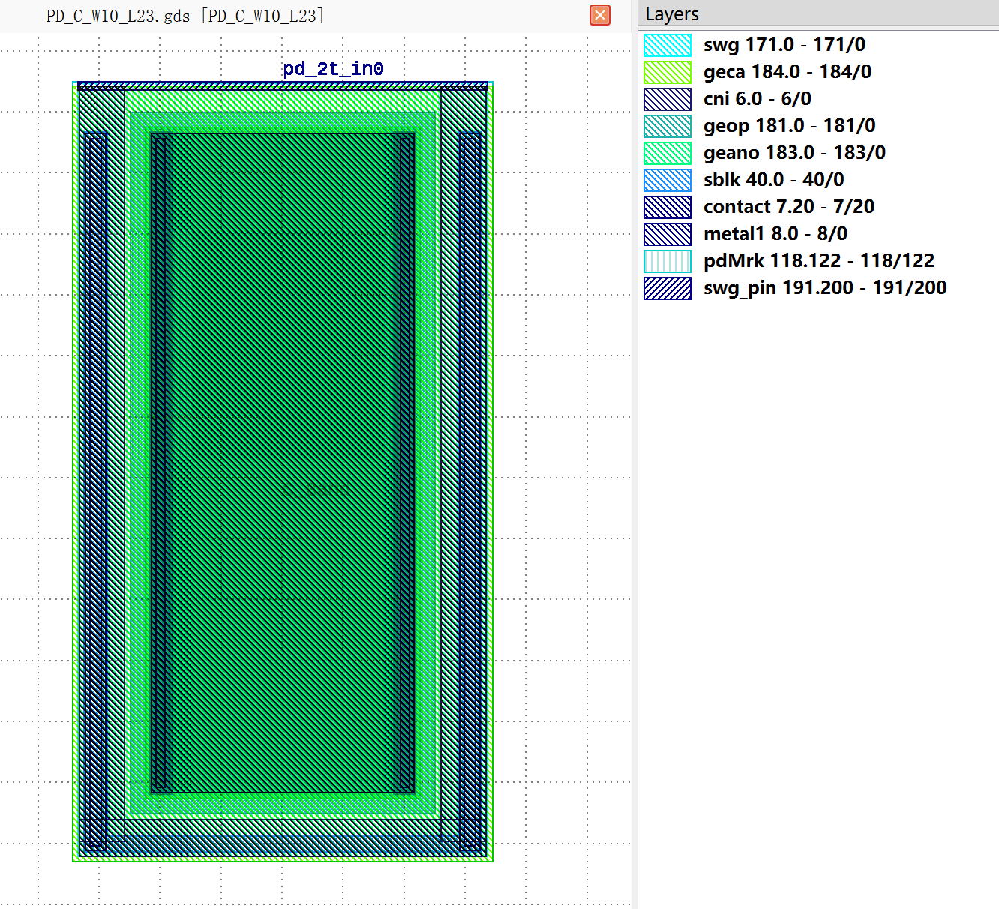
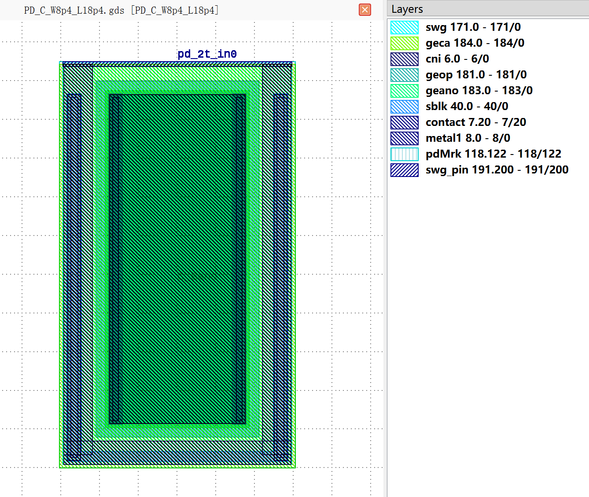
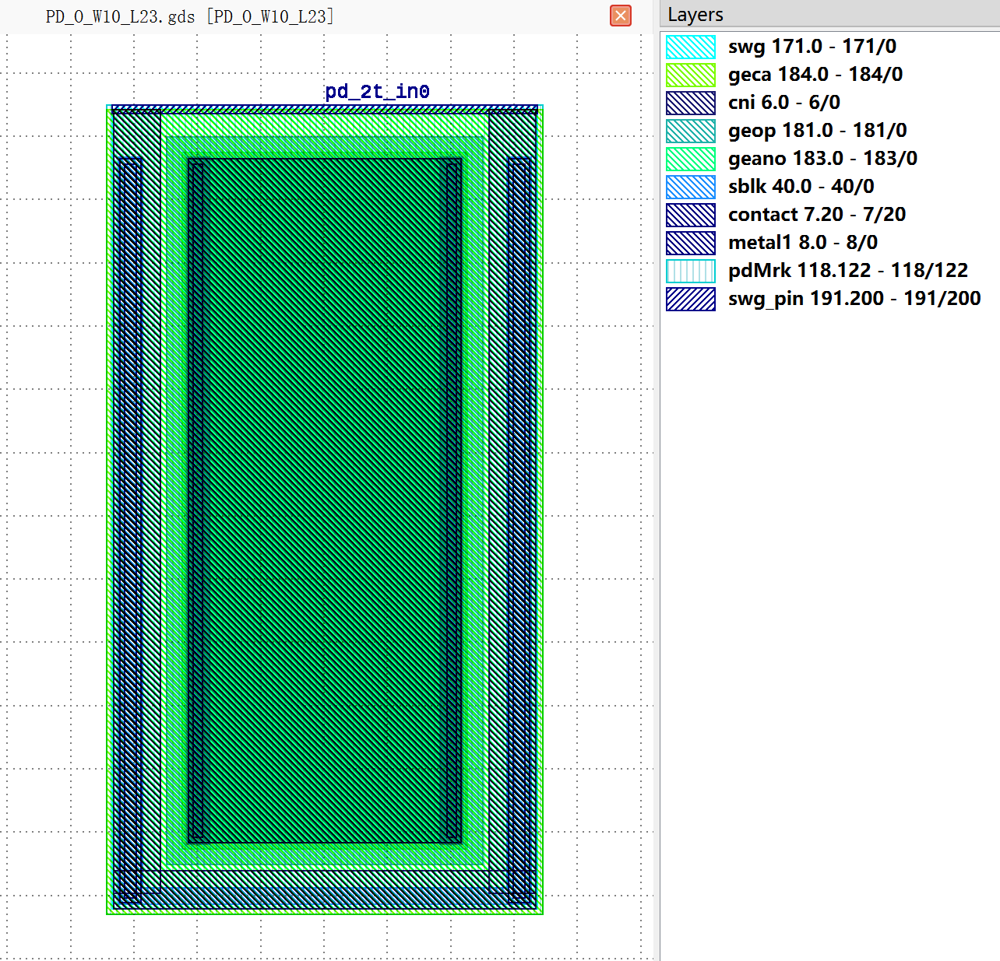
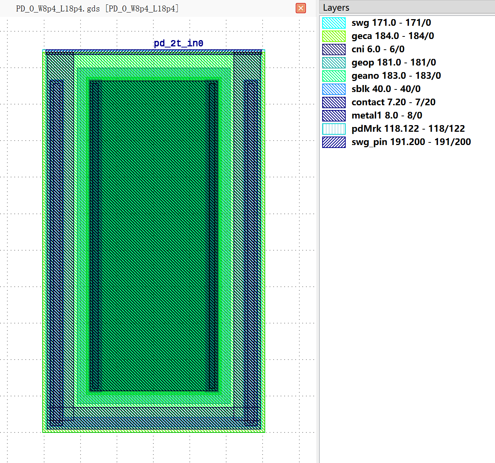
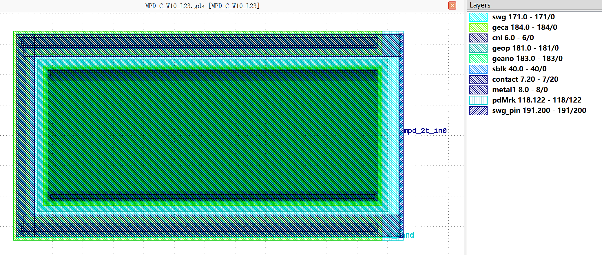
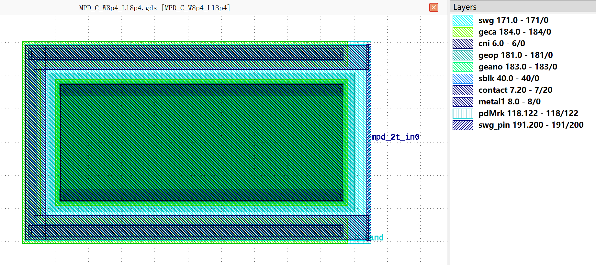
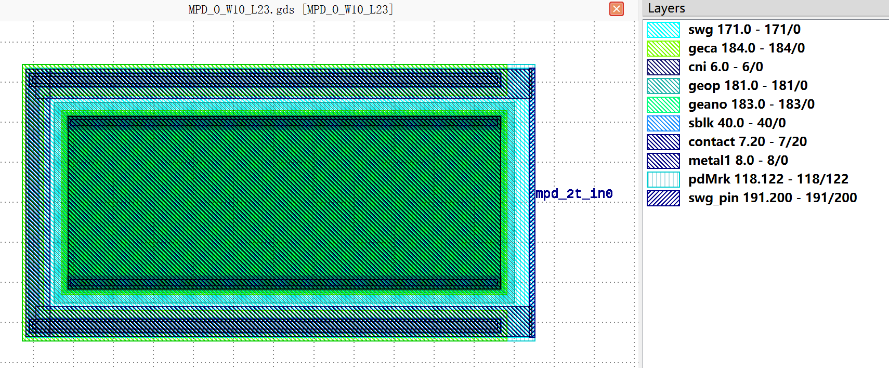
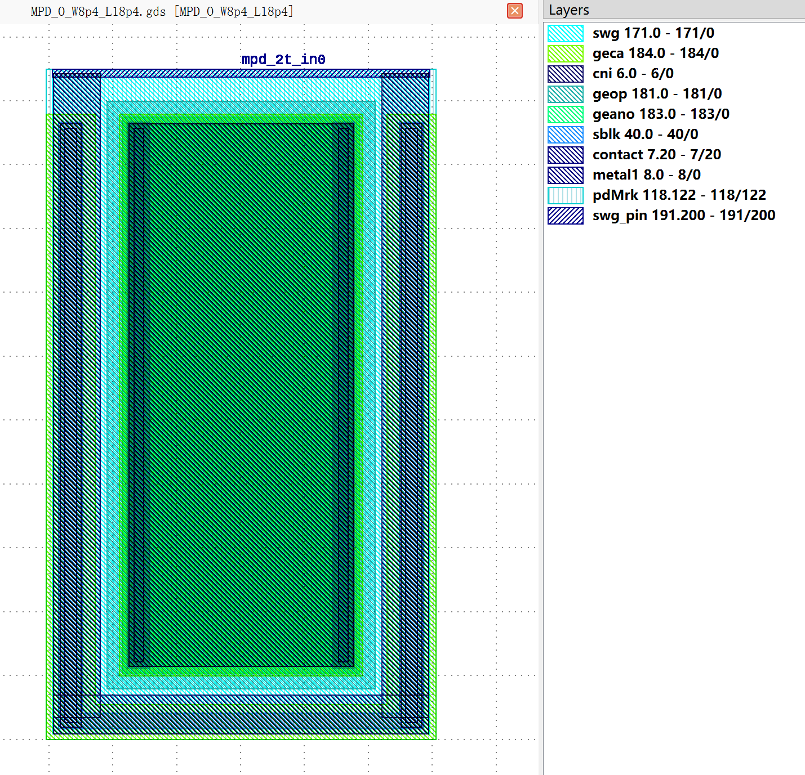

Photodiode
##########

PD_C_W10_L23
************

+---------------------------+-----------------------------------------+-----------------------------+
|           ports           |              waveguide type             |         orientation         |
+===========================+=========================================+=============================+
|         pd_2t_in0         |         TECH.WG.Strip.C.WIRE_TE         |              90             |
+---------------------------+-----------------------------------------+-----------------------------+

PD_C_W8p4_L18p4
***************

+---------------------------+-----------------------------------------+-----------------------------+
|           ports           |              waveguide type             |         orientation         |
+===========================+=========================================+=============================+
|         pd_2t_in0         |         TECH.WG.Strip.C.WIRE_TE         |              90             |
+---------------------------+-----------------------------------------+-----------------------------+

PD_O_W10_L23
************

+---------------------------+-----------------------------------------+-----------------------------+
|           ports           |              waveguide type             |         orientation         |
+===========================+=========================================+=============================+
|         pd_2t_in0         |         TECH.WG.Strip.O.WIRE_TE         |              90             |
+---------------------------+-----------------------------------------+-----------------------------+

PD_O_W8p4_L18p4
***************

+---------------------------+-----------------------------------------+-----------------------------+
|           ports           |              waveguide type             |         orientation         |
+===========================+=========================================+=============================+
|         pd_2t_in0         |         TECH.WG.Strip.O.WIRE_TE         |              90             |
+---------------------------+-----------------------------------------+-----------------------------+

MPD_C_W10_L23
*************

+----------------------------+-----------------------------------------+-----------------------------+
|            ports           |              waveguide type             |         orientation         |
+============================+=========================================+=============================+
|          mpd_2t_in0        |         TECH.WG.Strip.C.WIRE_TE         |              0              |
+----------------------------+-----------------------------------------+-----------------------------+

MPD_C_W8p4_L18p4
****************

+----------------------------+-----------------------------------------+-----------------------------+
|            ports           |              waveguide type             |         orientation         |
+============================+=========================================+=============================+
|          mpd_2t_in0        |         TECH.WG.Strip.C.WIRE_TE         |              0              |
+----------------------------+-----------------------------------------+-----------------------------+

MPD_O_W10_L23
*************

+----------------------------+-----------------------------------------+-----------------------------+
|            ports           |              waveguide type             |         orientation         |
+============================+=========================================+=============================+
|          mpd_2t_in0        |         TECH.WG.Strip.O.WIRE_TE         |              0              |
+----------------------------+-----------------------------------------+-----------------------------+

MPD_O_W8p4_L18p4
****************

+----------------------------+-----------------------------------------+-----------------------------+
|            ports           |              waveguide type             |         orientation         |
+============================+=========================================+=============================+
|          mpd_2t_in0        |         TECH.WG.Strip.O.WIRE_TE         |              90             |
+----------------------------+-----------------------------------------+-----------------------------+
