AdvancedSDL
=======================================

Import Tower_PH18MK_PDK into AdvancedSDL
***************************************************************************************

Click ``PDK`` on the top toolbar of **AdvancedSDL** and select ``Open PDK Symbol Design``.

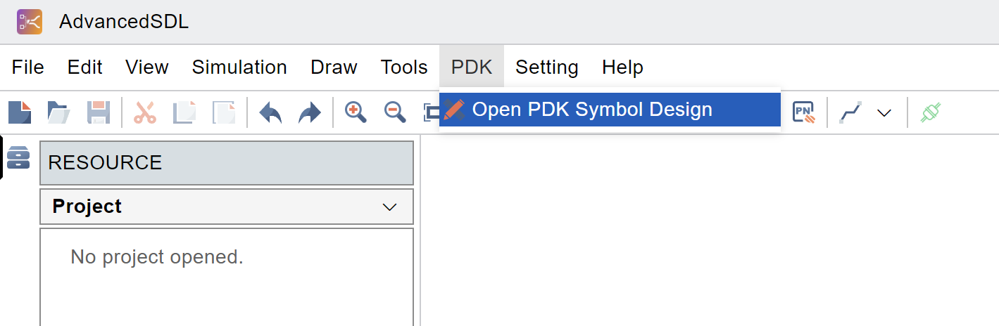

Locate and select the ``towersemi_ph18mk`` folder.

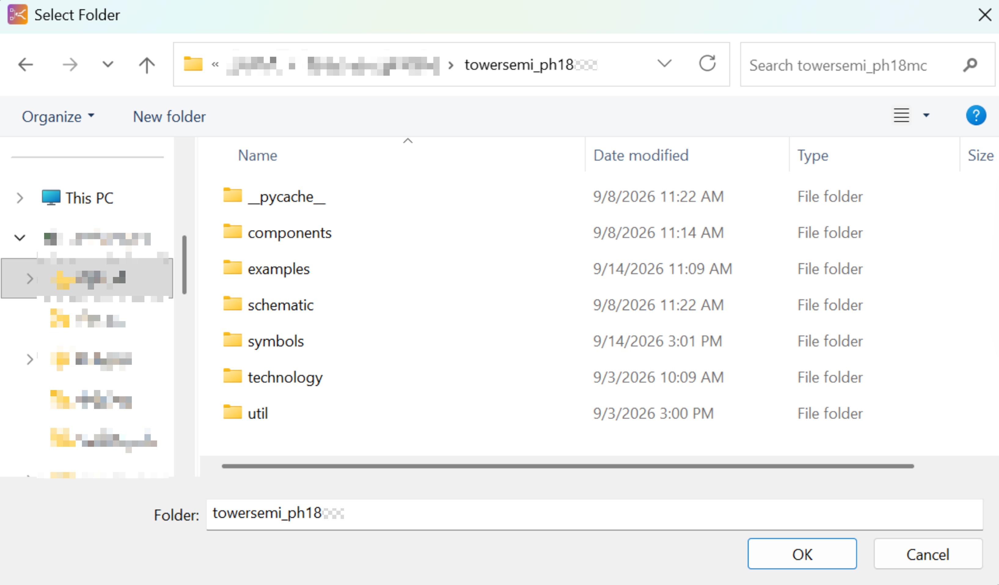

After the import is complete, you will see the ``towersemi_ph18mk`` component library on the left.

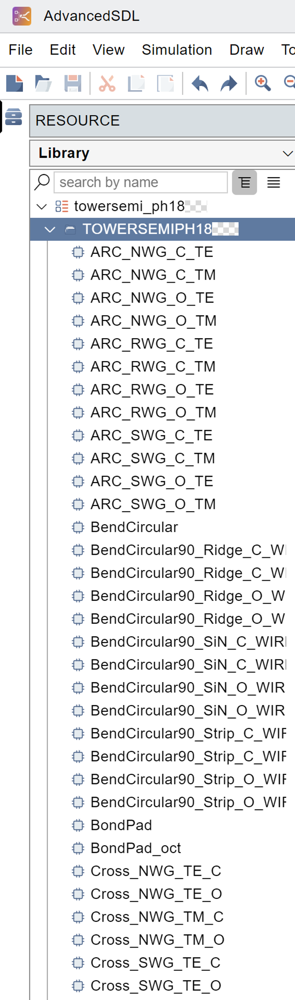

Click ``File`` and then click ``New Project``.

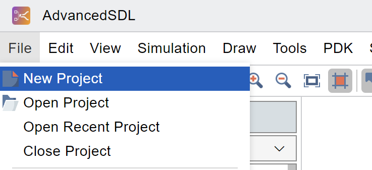

Enter the project name and path, select ``towersemi_ph18mk`` in the PDK column, and click ``OK``.

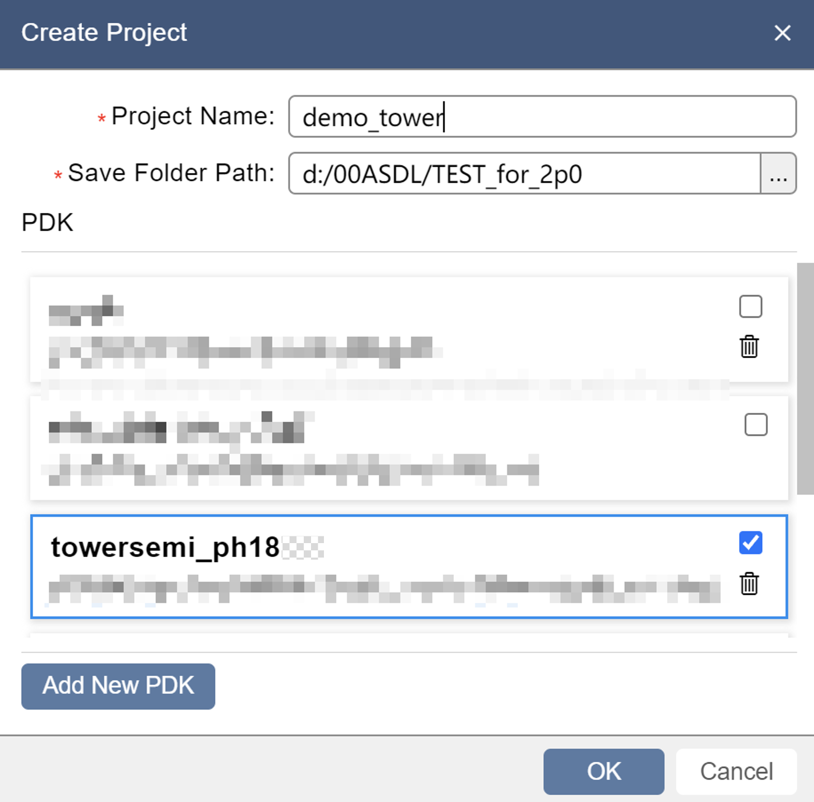

Wait for the contents of ``Import towersemi_ph18mk PDK symbols succeeded`` to appear in the output.

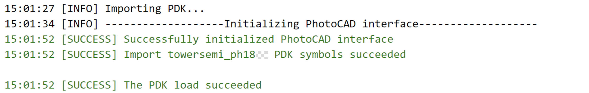

Drag components to the center region.

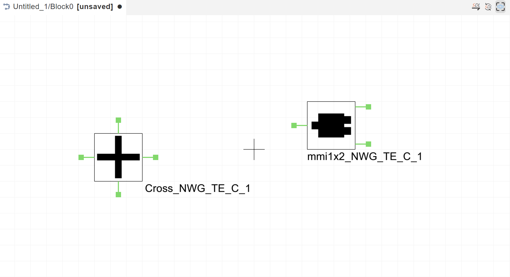

Click on the component, the parameters of the component can be adjusted on the right side.

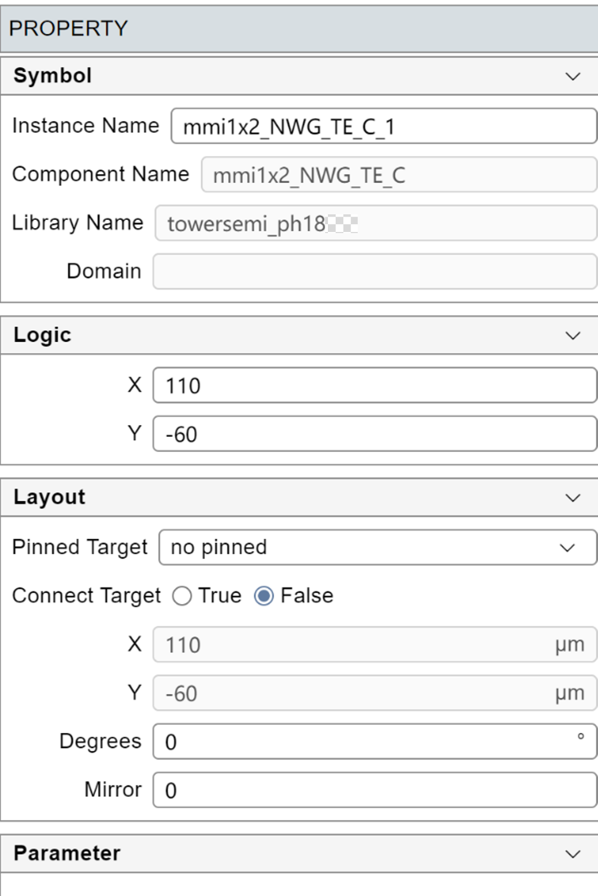

Once the parameters are set, connect the ports to route the components and click SDL in the upper right.

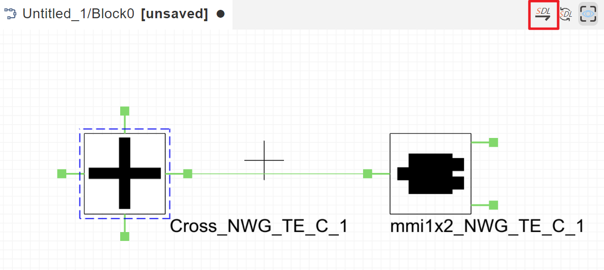

The corresponding layout is displayed in the ``Layout View``.

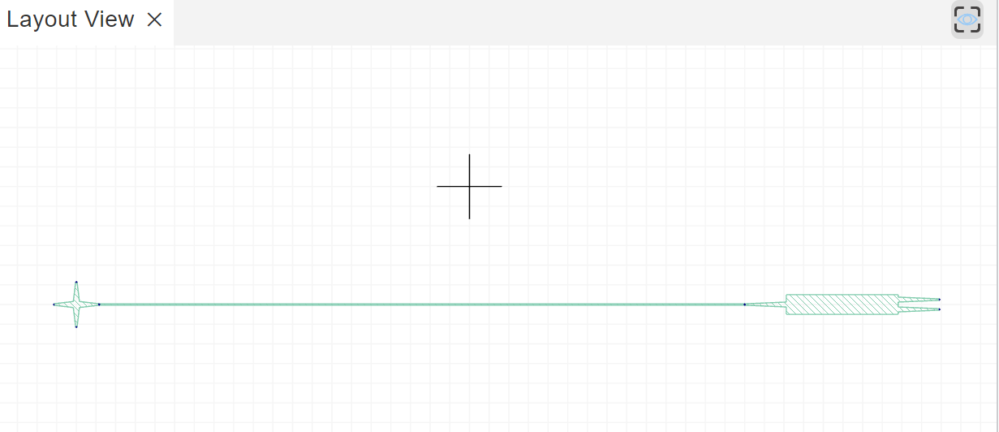

The script generated in the lower left can also be run in **PhotoCAD** and modified to create a new layout. The script is saved in the project's Temp folder.

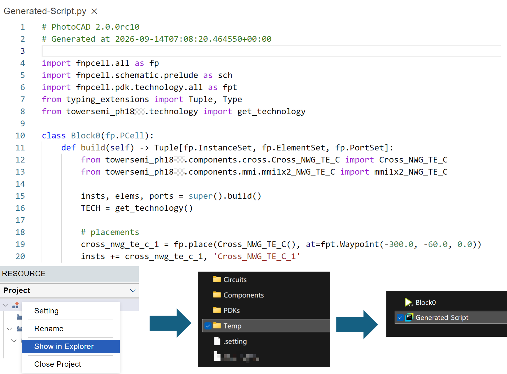

You can also easily import a specific component to **AdvancedSDL** on **PhotoCAD** using ``fp.export_schematic``. See ``gpdk > examples`` for more information.