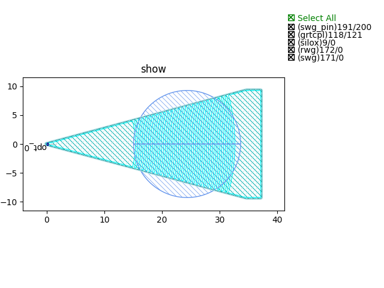
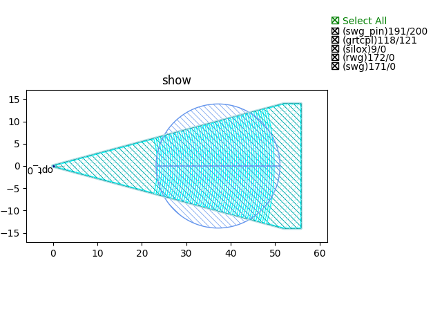
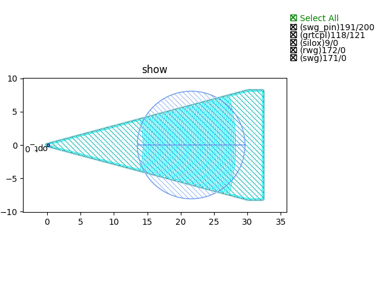
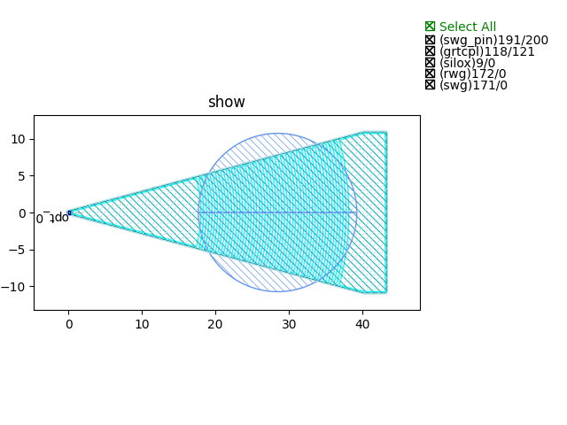

Grating Couplers (GC)
#############################

GC_C_TE
*******************************************

+--------------------+-----------------------------+-------------+
|        ports       |     waveguide type          | orientation |
+====================+=============================+=============+
| opt_0              |  TECH.WG.Strip.C.WIRE_TE    |    180      |
+--------------------+-----------------------------+-------------+

GC_C_TM
*******************************************

+--------------------+-----------------------------+-------------+
|        ports       |     waveguide type          | orientation |
+====================+=============================+=============+
| opt_0              |  TECH.WG.Strip.C.WIRE_TM    |    180      |
+--------------------+-----------------------------+-------------+

GC_O_TE
*******************************************

+--------------------+-----------------------------+-------------+
|        ports       |     waveguide type          | orientation |
+====================+=============================+=============+
| opt_0              |  TECH.WG.Strip.O.WIRE_TE    |    180      |
+--------------------+-----------------------------+-------------+

GC_O_TM
*******************************************

+--------------------+-----------------------------+-------------+
|        ports       |     waveguide type          | orientation |
+====================+=============================+=============+
| opt_0              |  TECH.WG.Strip.O.WIRE_TM    |    180      |
+--------------------+-----------------------------+-------------+

