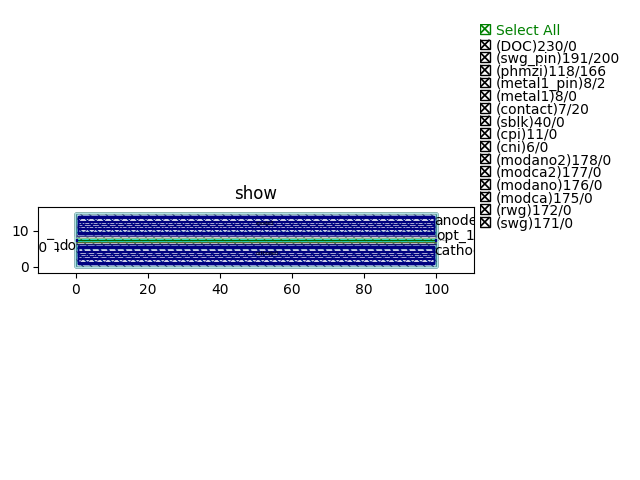

Phase Shifter
####################################

PS_C
**************************************************

+---------------------------------+-----------------------------+-------------+
|             ports               |     waveguide type          | orientation |
+=================================+=============================+=============+
|             opt_0               |   TECH.WG.Strip.C.WIRE_TE   |    180      |
+---------------------------------+-----------------------------+-------------+
|             opt_1               |   TECH.WG.Strip.C.WIRE_TE   |      0      |
+---------------------------------+-----------------------------+-------------+
|          cathode_0              |   TECH.METAL.M1.W4_775      |      0      |
+---------------------------------+-----------------------------+-------------+
|            anode_0              |   TECH.METAL.M1.W4_775      |      0      |
+---------------------------------+-----------------------------+-------------+

PS_O
**************************************************
.. image:: ../images/PS_O.png

+---------------------------------+-----------------------------+-------------+
|             ports               |     waveguide type          | orientation |
+=================================+=============================+=============+
|             opt_0               |   TECH.WG.Strip.O.WIRE_TE   |    180      |
+---------------------------------+-----------------------------+-------------+
|             opt_1               |   TECH.WG.Strip.O.WIRE_TE   |      0      |
+---------------------------------+-----------------------------+-------------+
|          cathode_0              |   TECH.METAL.M1.W4_775      |      0      |
+---------------------------------+-----------------------------+-------------+
|            anode_0              |   TECH.METAL.M1.W4_775      |      0      |
+---------------------------------+-----------------------------+-------------+
