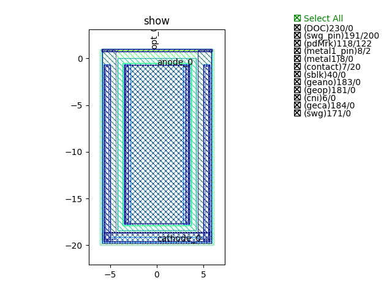
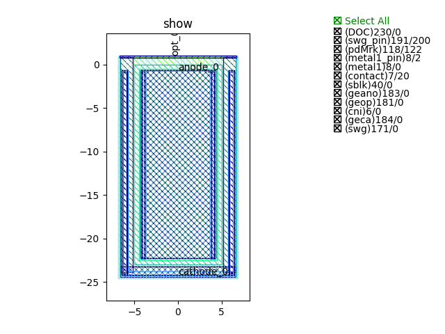
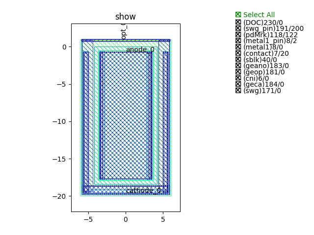
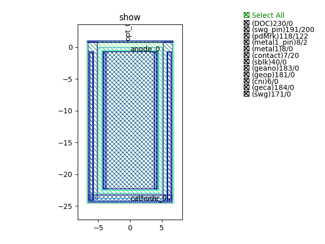

Photodiode
####################################

PD_C_W8p4_L18p4
**************************************************

+---------------------------------+-----------------------------+-------------+
|             ports               |     waveguide type          | orientation |
+=================================+=============================+=============+
|             opt_0               |   TECH.WG.Strip.C.WIRE_TE   |     90      |
+---------------------------------+-----------------------------+-------------+
|          cathode_0              |   TECH.METAL.M1.W0_66       |      90     |
+---------------------------------+-----------------------------+-------------+
|          cathode_1              |   TECH.METAL.M1.W0_66       |      90     |
+---------------------------------+-----------------------------+-------------+
|           anode_0               |    TECH.METAL.M1.W7         |      90     |
+---------------------------------+-----------------------------+-------------+

PD_C_W10_L23
**************************************************

+---------------------------------+-----------------------------+-------------+
|             ports               |     waveguide type          | orientation |
+=================================+=============================+=============+
|             opt_0               |   TECH.WG.Strip.C.WIRE_TE   |     90      |
+---------------------------------+-----------------------------+-------------+
|          cathode_0              |   TECH.METAL.M1.W0_66       |      90     |
+---------------------------------+-----------------------------+-------------+
|          cathode_1              |   TECH.METAL.M1.W0_66       |      90     |
+---------------------------------+-----------------------------+-------------+
|           anode_0               |   TECH.METAL.M1.W8_6        |      90     |
+---------------------------------+-----------------------------+-------------+

PD_O_W8p4_L18p4
**************************************************

+---------------------------------+-----------------------------+-------------+
|             ports               |     waveguide type          | orientation |
+=================================+=============================+=============+
|             opt_0               |   TECH.WG.Strip.O.WIRE_TE   |     90      |
+---------------------------------+-----------------------------+-------------+
|          cathode_0              |   TECH.METAL.M1.W0_66       |      90     |
+---------------------------------+-----------------------------+-------------+
|          cathode_1              |   TECH.METAL.M1.W0_66       |      90     |
+---------------------------------+-----------------------------+-------------+
|           anode_0               |    TECH.METAL.M1.W7         |      90     |
+---------------------------------+-----------------------------+-------------+

PD_O_W10_L23
**************************************************

+---------------------------------+-----------------------------+-------------+
|             ports               |     waveguide type          | orientation |
+=================================+=============================+=============+
|             opt_0               |   TECH.WG.Strip.O.WIRE_TE   |     90      |
+---------------------------------+-----------------------------+-------------+
|          cathode_0              |   TECH.METAL.M1.W0_66       |      90     |
+---------------------------------+-----------------------------+-------------+
|          cathode_1              |   TECH.METAL.M1.W0_66       |      90     |
+---------------------------------+-----------------------------+-------------+
|           anode_0               |   TECH.METAL.M1.W8_6        |      90     |
+---------------------------------+-----------------------------+-------------+