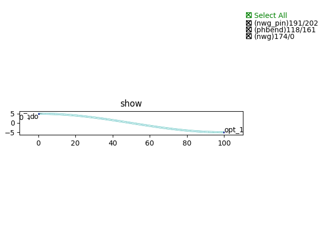
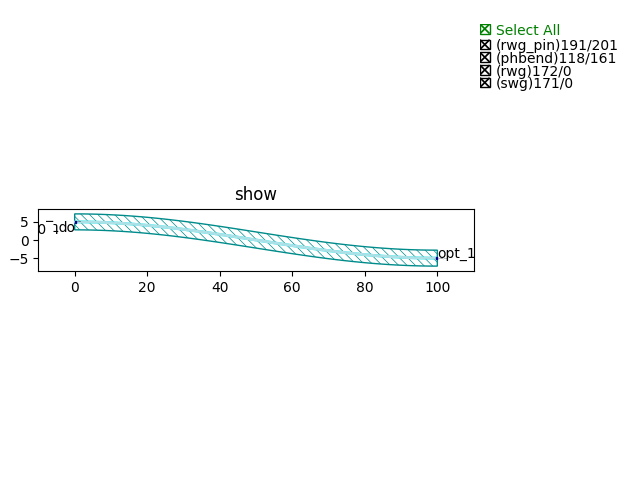
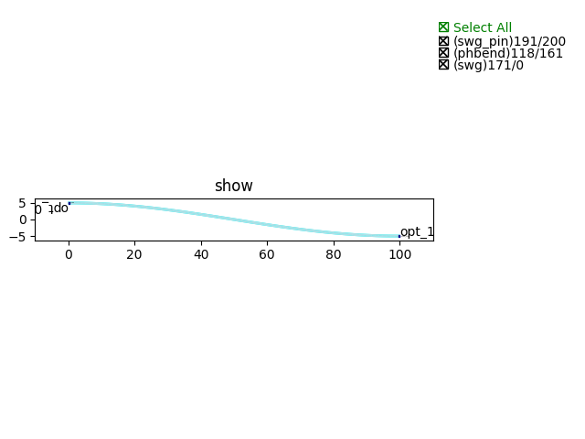
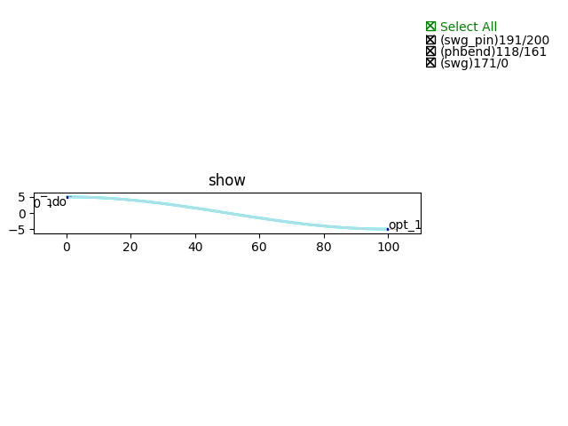

S bend
#############################

Sbend_NWG_C_TE
**********************************************************
.. image:: ../images/Sbend_NWG_C_TE.png

+-------------------+-----------------------------+-------------+
|     ports         |     waveguide type          | orientation |
+===================+=============================+=============+
|    opt_0          | TECH.WG.SiN_strip.C.WIRE_TE |    180      |
+-------------------+-----------------------------+-------------+
|    opt_1          | TECH.WG.SiN_strip.C.WIRE_TE |      0      |
+-------------------+-----------------------------+-------------+

Sbend_NWG_C_TM
**********************************************************
.. image:: ../images/Sbend_NWG_C_TM.png

+-------------------+-----------------------------+-------------+
|     ports         |     waveguide type          | orientation |
+===================+=============================+=============+
|     opt_0         | TECH.WG.SiN_strip.C.WIRE_TM |    180      |
+-------------------+-----------------------------+-------------+
|     opt_1         | TECH.WG.SiN_strip.C.WIRE_TM |      0      |
+-------------------+-----------------------------+-------------+

Sbend_NWG_O_TE
**********************************************************

+-------------------+-----------------------------+-------------+
|     ports         |     waveguide type          | orientation |
+===================+=============================+=============+
|     opt_0         | TECH.WG.SiN_strip.O.WIRE_TE |    180      |
+-------------------+-----------------------------+-------------+
|     opt_1         | TECH.WG.SiN_strip.O.WIRE_TE |      0      |
+-------------------+-----------------------------+-------------+

Sbend_NWG_O_TM
**********************************************************
.. image:: ../images/Sbend_NWG_O_TM.png

+-------------------+-----------------------------+-------------+
|     ports         |     waveguide type          | orientation |
+===================+=============================+=============+
|     opt_0         | TECH.WG.SiN_strip.O.WIRE_TM |    180      |
+-------------------+-----------------------------+-------------+
|     opt_1         | TECH.WG.SiN_strip.O.WIRE_TM |      0      |
+-------------------+-----------------------------+-------------+

Sbend_RWG_C_TE
**********************************************************
.. image:: ../images/Sbend_RWG_C_TE.png

+-------------------+-----------------------------+-------------+
|     ports         |     waveguide type          | orientation |
+===================+=============================+=============+
|     opt_0         |   TECH.WG.Ridge.C.WIRE_TE   |    180      |
+-------------------+-----------------------------+-------------+
|     opt_1         |   TECH.WG.Ridge.C.WIRE_TE   |      0      |
+-------------------+-----------------------------+-------------+

Sbend_RWG_C_TM
**********************************************************

+-------------------+-----------------------------+-------------+
|     ports         |     waveguide type          | orientation |
+===================+=============================+=============+
|     opt_0         |   TECH.WG.Ridge.C.WIRE_TM   |    180      |
+-------------------+-----------------------------+-------------+
|     opt_1         |   TECH.WG.Ridge.C.WIRE_TM   |      0      |
+-------------------+-----------------------------+-------------+

Sbend_RWG_O_TE
**********************************************************

+-------------------+-----------------------------+-------------+
|     ports         |     waveguide type          | orientation |
+===================+=============================+=============+
|     opt_0         |   TECH.WG.Ridge.O.WIRE_TE   |    180      |
+-------------------+-----------------------------+-------------+
|     opt_1         |   TECH.WG.Ridge.O.WIRE_TE   |      0      |
+-------------------+-----------------------------+-------------+

Sbend_RWG_O_TM
**********************************************************
.. image:: ../images/Sbend_RWG_O_TM.png

+-------------------+-----------------------------+-------------+
|     ports         |     waveguide type          | orientation |
+===================+=============================+=============+
|     opt_0         |   TECH.WG.Ridge.O.WIRE_TM   |    180      |
+-------------------+-----------------------------+-------------+
|     opt_1         |   TECH.WG.Ridge.O.WIRE_TM   |      0      |
+-------------------+-----------------------------+-------------+

Sbend_SWG_C_TE
**********************************************************

+-------------------+-----------------------------+-------------+
|     ports         |     waveguide type          | orientation |
+===================+=============================+=============+
|     opt_0         |   TECH.WG.Strip.C.WIRE_TE   |    180      |
+-------------------+-----------------------------+-------------+
|     opt_1         |   TECH.WG.Strip.C.WIRE_TE   |      0      |
+-------------------+-----------------------------+-------------+

Sbend_SWG_C_TM
**********************************************************
.. image:: ../images/Sbend_SWG_C_TM.png

+-------------------+-----------------------------+-------------+
|     ports         |     waveguide type          | orientation |
+===================+=============================+=============+
|     opt_0         |   TECH.WG.Strip.C.WIRE_TM   |    180      |
+-------------------+-----------------------------+-------------+
|     opt_1         |   TECH.WG.Strip.C.WIRE_TM   |      0      |
+-------------------+-----------------------------+-------------+

Sbend_SWG_O_TE
**********************************************************
.. image:: ../images/Sbend_SWG_O_TE.png

+-------------------+-----------------------------+-------------+
|     ports         |     waveguide type          | orientation |
+===================+=============================+=============+
|     opt_0         |   TECH.WG.Strip.O.WIRE_TE   |    180      |
+-------------------+-----------------------------+-------------+
|     opt_1         |   TECH.WG.Strip.O.WIRE_TE   |      0      |
+-------------------+-----------------------------+-------------+

Sbend_SWG_O_TM
**********************************************************

+-------------------+-----------------------------+-------------+
|     ports         |     waveguide type          | orientation |
+===================+=============================+=============+
|     opt_0         |   TECH.WG.Strip.O.WIRE_TM   |    180      |
+-------------------+-----------------------------+-------------+
|     opt_1         |   TECH.WG.Strip.O.WIRE_TM   |      0      |
+-------------------+-----------------------------+-------------+