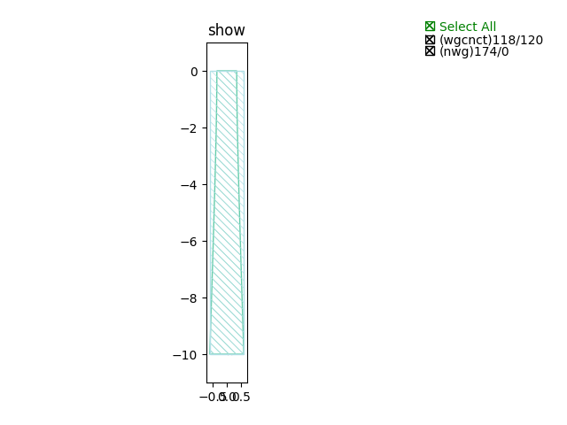
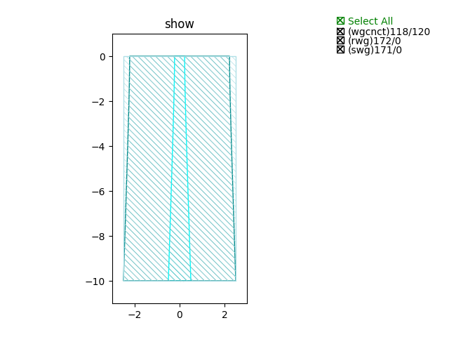

Taper
#############################

NWG_linear_C_TE
**********************************************************
.. image:: ../images/NWG_linear_C_TE.png

+-------------------+-----------------------------+-------------+
|     ports         |     waveguide type          | orientation |
+===================+=============================+=============+
|  wg_taper_in0     | TECH.WG.SiN_strip.C.WIRE_TE |    90       |
+-------------------+-----------------------------+-------------+
|  wg_taper_out0    | TECH.WG.SiN_strip.C.WIRE_TE |    270      |
+-------------------+-----------------------------+-------------+

NWG_linear_C_TM
**********************************************************
.. image:: ../images/NWG_linear_C_TM.png

+-------------------+-----------------------------+-------------+
|     ports         |     waveguide type          | orientation |
+===================+=============================+=============+
|  wg_taper_in0     | TECH.WG.SiN_strip.C.WIRE_TM |    90       |
+-------------------+-----------------------------+-------------+
|  wg_taper_out0    | TECH.WG.SiN_strip.C.WIRE_TM |    270      |
+-------------------+-----------------------------+-------------+

NWG_linear_O_TE
**********************************************************

+-------------------+-----------------------------+-------------+
|     ports         |     waveguide type          | orientation |
+===================+=============================+=============+
|  wg_taper_in0     | TECH.WG.SiN_strip.O.WIRE_TE |    90       |
+-------------------+-----------------------------+-------------+
|  wg_taper_out0    | TECH.WG.SiN_strip.O.WIRE_TE |    270      |
+-------------------+-----------------------------+-------------+

NWG_linear_O_TM
**********************************************************
.. image:: ../images/NWG_linear_O_TM.png

+-------------------+-----------------------------+-------------+
|     ports         |     waveguide type          | orientation |
+===================+=============================+=============+
|  wg_taper_in0     | TECH.WG.SiN_strip.O.WIRE_TM |    90       |
+-------------------+-----------------------------+-------------+
|  wg_taper_out0    | TECH.WG.SiN_strip.O.WIRE_TM |    270      |
+-------------------+-----------------------------+-------------+

RWG_linear_C_TE
**********************************************************

+-------------------+-----------------------------+-------------+
|     ports         |     waveguide type          | orientation |
+===================+=============================+=============+
|  wg_taper_in0     |   TECH.WG.Ridge.C.WIRE_TE   |    90       |
+-------------------+-----------------------------+-------------+
|  wg_taper_out0    |   TECH.WG.Ridge.C.WIRE_TE   |    270      |
+-------------------+-----------------------------+-------------+

RWG_linear_C_TM
**********************************************************

+-------------------+-----------------------------+-------------+
|     ports         |     waveguide type          | orientation |
+===================+=============================+=============+
|  wg_taper_in0     |   TECH.WG.Ridge.C.WIRE_TM   |    90       |
+-------------------+-----------------------------+-------------+
|  wg_taper_out0    |   TECH.WG.Ridge.C.WIRE_TM   |    270      |
+-------------------+-----------------------------+-------------+

RWG_linear_O_TE
**********************************************************
.. image:: ../images/RWG_linear_O_TE.png

+-------------------+-----------------------------+-------------+
|     ports         |     waveguide type          | orientation |
+===================+=============================+=============+
|  wg_taper_in0     |   TECH.WG.Ridge.O.WIRE_TE   |    90       |
+-------------------+-----------------------------+-------------+
|  wg_taper_out0    |   TECH.WG.Ridge.O.WIRE_TE   |    270      |
+-------------------+-----------------------------+-------------+

RWG_linear_O_TM
**********************************************************

+-------------------+-----------------------------+-------------+
|     ports         |     waveguide type          | orientation |
+===================+=============================+=============+
|  wg_taper_in0     |   TECH.WG.Ridge.O.WIRE_TM   |    90       |
+-------------------+-----------------------------+-------------+
|  wg_taper_out0    |   TECH.WG.Ridge.O.WIRE_TM   |    270      |
+-------------------+-----------------------------+-------------+

SWG_linear_C_TE
**********************************************************
.. image:: ../images/SWG_linear_C_TE.png

+-------------------+-----------------------------+-------------+
|     ports         |     waveguide type          | orientation |
+===================+=============================+=============+
|  wg_taper_in0     |   TECH.WG.Strip.C.WIRE_TE   |    90       |
+-------------------+-----------------------------+-------------+
|  wg_taper_out0    |   TECH.WG.Strip.C.WIRE_TE   |    270      |
+-------------------+-----------------------------+-------------+

SWG_linear_C_TM
**********************************************************

+-------------------+-----------------------------+-------------+
|     ports         |     waveguide type          | orientation |
+===================+=============================+=============+
|  wg_taper_in0     |   TECH.WG.Strip.C.WIRE_TM   |    90       |
+-------------------+-----------------------------+-------------+
|  wg_taper_out0    |   TECH.WG.Strip.C.WIRE_TM   |    270      |
+-------------------+-----------------------------+-------------+

SWG_linear_O_TE
**********************************************************

+-------------------+-----------------------------+-------------+
|     ports         |     waveguide type          | orientation |
+===================+=============================+=============+
|  wg_taper_in0     |   TECH.WG.Strip.O.WIRE_TE   |    90       |
+-------------------+-----------------------------+-------------+
|  wg_taper_out0    |   TECH.WG.Strip.O.WIRE_TE   |    270      |
+-------------------+-----------------------------+-------------+

SWG_linear_O_TM
**********************************************************
.. image:: ../images/SWG_linear_O_TM.png

+-------------------+-----------------------------+-------------+
|     ports         |     waveguide type          | orientation |
+===================+=============================+=============+
|  wg_taper_in0     |   TECH.WG.Strip.O.WIRE_TM   |    90       |
+-------------------+-----------------------------+-------------+
|  wg_taper_out0    |   TECH.WG.Strip.O.WIRE_TM   |    270      |
+-------------------+-----------------------------+-------------+