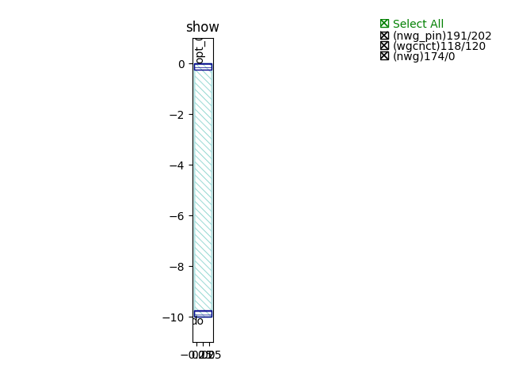
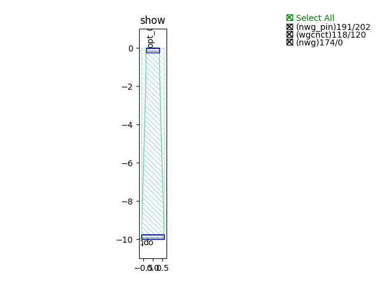
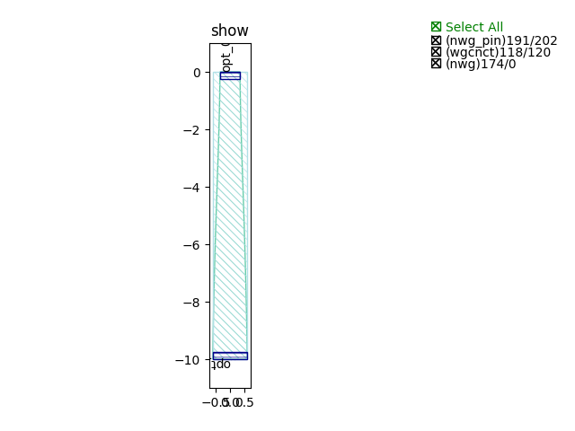
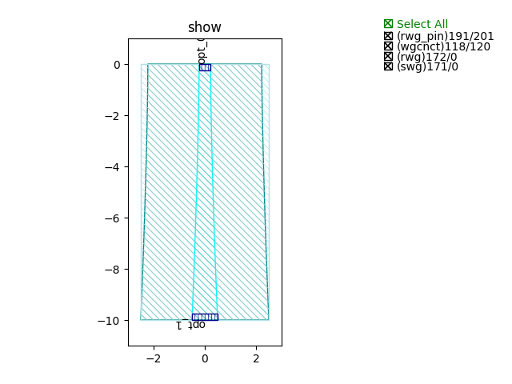
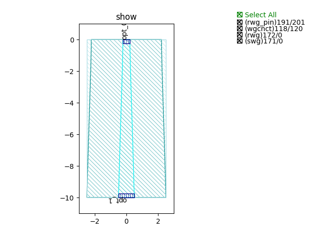
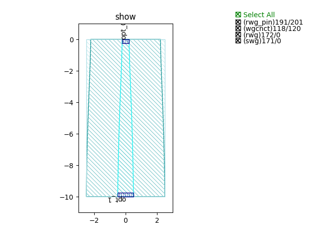
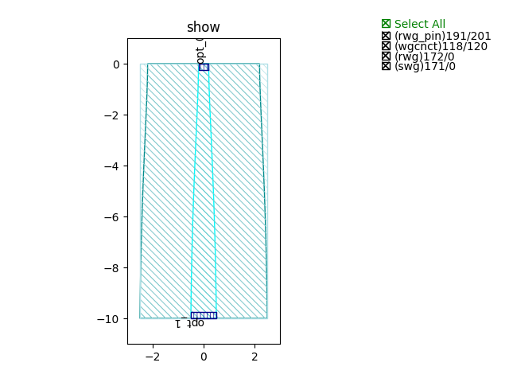
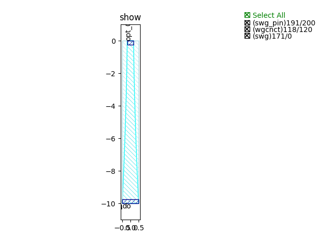
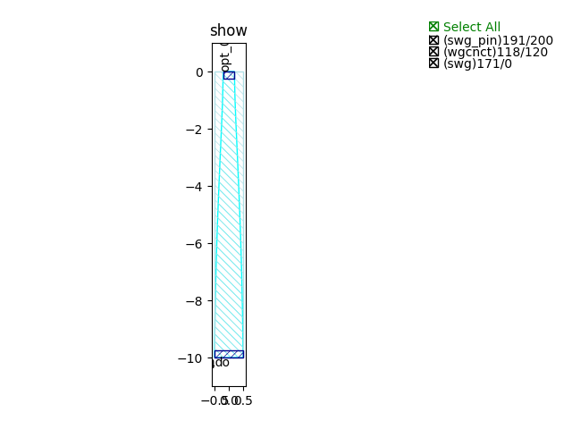

Taper
#############################

NWG_exponential_C_TE
**********************************************************

+-------------------+-----------------------------+-------------+
|     ports         |     waveguide type          | orientation |
+===================+=============================+=============+
|     opt_0         | TECH.WG.SiN_strip.C.WIRE_TE |    90       |
+-------------------+-----------------------------+-------------+
|     opt_1         | TECH.WG.SiN_strip.C.WIRE_TE |    270      |
+-------------------+-----------------------------+-------------+

NWG_exponential_C_TM
**********************************************************
.. image:: ../images/NWG_exponential_C_TM.png

+-------------------+-----------------------------+-------------+
|     ports         |     waveguide type          | orientation |
+===================+=============================+=============+
|     opt_0         | TECH.WG.SiN_strip.C.WIRE_TM |    90       |
+-------------------+-----------------------------+-------------+
|     opt_1         | TECH.WG.SiN_strip.C.WIRE_TM |    270      |
+-------------------+-----------------------------+-------------+

NWG_exponential_O_TE
**********************************************************

+-------------------+-----------------------------+-------------+
|     ports         |     waveguide type          | orientation |
+===================+=============================+=============+
|     opt_0         | TECH.WG.SiN_strip.O.WIRE_TE |    90       |
+-------------------+-----------------------------+-------------+
|     opt_1         | TECH.WG.SiN_strip.O.WIRE_TE |    270      |
+-------------------+-----------------------------+-------------+

NWG_exponential_O_TM
**********************************************************
.. image:: ../images/NWG_exponential_O_TM.png

+-------------------+-----------------------------+-------------+
|     ports         |     waveguide type          | orientation |
+===================+=============================+=============+
|     opt_0         | TECH.WG.SiN_strip.O.WIRE_TM |    90       |
+-------------------+-----------------------------+-------------+
|     opt_1         | TECH.WG.SiN_strip.O.WIRE_TM |    270      |
+-------------------+-----------------------------+-------------+

NWG_linear_C_TE
**********************************************************
.. image:: ../images/NWG_linear_C_TE.png

+-------------------+-----------------------------+-------------+
|     ports         |     waveguide type          | orientation |
+===================+=============================+=============+
|     opt_0         | TECH.WG.SiN_strip.C.WIRE_TE |    90       |
+-------------------+-----------------------------+-------------+
|     opt_1         | TECH.WG.SiN_strip.C.WIRE_TE |    270      |
+-------------------+-----------------------------+-------------+

NWG_linear_C_TM
**********************************************************
.. image:: ../images/NWG_linear_C_TM.png

+-------------------+-----------------------------+-------------+
|     ports         |     waveguide type          | orientation |
+===================+=============================+=============+
|     opt_0         | TECH.WG.SiN_strip.C.WIRE_TM |    90       |
+-------------------+-----------------------------+-------------+
|     opt_1         | TECH.WG.SiN_strip.C.WIRE_TM |    270      |
+-------------------+-----------------------------+-------------+

NWG_linear_O_TE
**********************************************************
.. image:: ../images/NWG_linear_O_TE.png

+-------------------+-----------------------------+-------------+
|     ports         |     waveguide type          | orientation |
+===================+=============================+=============+
|     opt_0         | TECH.WG.SiN_strip.O.WIRE_TE |    90       |
+-------------------+-----------------------------+-------------+
|     opt_1         | TECH.WG.SiN_strip.O.WIRE_TE |    270      |
+-------------------+-----------------------------+-------------+

NWG_linear_O_TM
**********************************************************
.. image:: ../images/NWG_linear_O_TM.png

+-------------------+-----------------------------+-------------+
|     ports         |     waveguide type          | orientation |
+===================+=============================+=============+
|     opt_0         | TECH.WG.SiN_strip.O.WIRE_TM |    90       |
+-------------------+-----------------------------+-------------+
|     opt_1         | TECH.WG.SiN_strip.O.WIRE_TM |    270      |
+-------------------+-----------------------------+-------------+

NWG_logarithmic_C_TE
**********************************************************

+-------------------+-----------------------------+-------------+
|     ports         |     waveguide type          | orientation |
+===================+=============================+=============+
|     opt_0         | TECH.WG.SiN_strip.C.WIRE_TE |    90       |
+-------------------+-----------------------------+-------------+
|     opt_1         | TECH.WG.SiN_strip.C.WIRE_TE |    270      |
+-------------------+-----------------------------+-------------+

NWG_logarithmic_C_TM
**********************************************************
.. image:: ../images/NWG_logarithmic_C_TM.png

+-------------------+-----------------------------+-------------+
|     ports         |     waveguide type          | orientation |
+===================+=============================+=============+
|     opt_0         | TECH.WG.SiN_strip.C.WIRE_TM |    90       |
+-------------------+-----------------------------+-------------+
|     opt_1         | TECH.WG.SiN_strip.C.WIRE_TM |    270      |
+-------------------+-----------------------------+-------------+

NWG_logarithmic_O_TE
**********************************************************
.. image:: ../images/NWG_logarithmic_O_TE.png

+-------------------+-----------------------------+-------------+
|     ports         |     waveguide type          | orientation |
+===================+=============================+=============+
|     opt_0         | TECH.WG.SiN_strip.O.WIRE_TE |    90       |
+-------------------+-----------------------------+-------------+
|     opt_1         | TECH.WG.SiN_strip.O.WIRE_TE |    270      |
+-------------------+-----------------------------+-------------+

NWG_logarithmic_O_TM
**********************************************************
.. image:: ../images/NWG_logarithmic_O_TM.png

+-------------------+-----------------------------+-------------+
|     ports         |     waveguide type          | orientation |
+===================+=============================+=============+
|     opt_0         | TECH.WG.SiN_strip.O.WIRE_TM |    90       |
+-------------------+-----------------------------+-------------+
|     opt_1         | TECH.WG.SiN_strip.O.WIRE_TM |    270      |
+-------------------+-----------------------------+-------------+

NWG_parabolic_C_TE
**********************************************************
.. image:: ../images/NWG_parabolic_C_TE.png

+-------------------+-----------------------------+-------------+
|     ports         |     waveguide type          | orientation |
+===================+=============================+=============+
|     opt_0         | TECH.WG.SiN_strip.C.WIRE_TE |    90       |
+-------------------+-----------------------------+-------------+
|     opt_1         | TECH.WG.SiN_strip.C.WIRE_TE |    270      |
+-------------------+-----------------------------+-------------+

NWG_parabolic_C_TM
**********************************************************

+-------------------+-----------------------------+-------------+
|     ports         |     waveguide type          | orientation |
+===================+=============================+=============+
|     opt_0         | TECH.WG.SiN_strip.C.WIRE_TM |    90       |
+-------------------+-----------------------------+-------------+
|     opt_1         | TECH.WG.SiN_strip.C.WIRE_TM |    270      |
+-------------------+-----------------------------+-------------+

NWG_parabolic_O_TE
**********************************************************
.. image:: ../images/NWG_parabolic_O_TE.png

+-------------------+-----------------------------+-------------+
|     ports         |     waveguide type          | orientation |
+===================+=============================+=============+
|     opt_0         | TECH.WG.SiN_strip.O.WIRE_TE |    90       |
+-------------------+-----------------------------+-------------+
|     opt_1         | TECH.WG.SiN_strip.O.WIRE_TE |    270      |
+-------------------+-----------------------------+-------------+

NWG_parabolic_O_TM
**********************************************************
.. image:: ../images/NWG_parabolic_O_TM.png

+-------------------+-----------------------------+-------------+
|     ports         |     waveguide type          | orientation |
+===================+=============================+=============+
|     opt_0         | TECH.WG.SiN_strip.O.WIRE_TM |    90       |
+-------------------+-----------------------------+-------------+
|     opt_1         | TECH.WG.SiN_strip.O.WIRE_TM |    270      |
+-------------------+-----------------------------+-------------+

RWG_exponential_C_TE
**********************************************************
.. image:: ../images/RWG_exponential_C_TE.png

+-------------------+-----------------------------+-------------+
|     ports         |     waveguide type          | orientation |
+===================+=============================+=============+
|     opt_0         |   TECH.WG.Ridge.C.WIRE_TE   |    90       |
+-------------------+-----------------------------+-------------+
|     opt_1         |   TECH.WG.Ridge.C.WIRE_TE   |    270      |
+-------------------+-----------------------------+-------------+

RWG_exponential_C_TM
**********************************************************

+-------------------+-----------------------------+-------------+
|     ports         |     waveguide type          | orientation |
+===================+=============================+=============+
|     opt_0         |   TECH.WG.Ridge.C.WIRE_TM   |    90       |
+-------------------+-----------------------------+-------------+
|     opt_1         |   TECH.WG.Ridge.C.WIRE_TM   |    270      |
+-------------------+-----------------------------+-------------+

RWG_exponential_O_TE
**********************************************************

+-------------------+-----------------------------+-------------+
|     ports         |     waveguide type          | orientation |
+===================+=============================+=============+
|     opt_0         |   TECH.WG.Ridge.O.WIRE_TE   |    90       |
+-------------------+-----------------------------+-------------+
|     opt_1         |   TECH.WG.Ridge.O.WIRE_TE   |    270      |
+-------------------+-----------------------------+-------------+

RWG_exponential_O_TM
**********************************************************
.. image:: ../images/RWG_exponential_O_TM.png

+-------------------+-----------------------------+-------------+
|     ports         |     waveguide type          | orientation |
+===================+=============================+=============+
|     opt_0         |   TECH.WG.Ridge.O.WIRE_TM   |    90       |
+-------------------+-----------------------------+-------------+
|     opt_1         |   TECH.WG.Ridge.O.WIRE_TM   |    270      |
+-------------------+-----------------------------+-------------+

RWG_linear_C_TE
**********************************************************
.. image:: ../images/RWG_linear_C_TE.png

+-------------------+-----------------------------+-------------+
|     ports         |     waveguide type          | orientation |
+===================+=============================+=============+
|     opt_0         |   TECH.WG.Ridge.C.WIRE_TE   |    90       |
+-------------------+-----------------------------+-------------+
|     opt_1         |   TECH.WG.Ridge.C.WIRE_TE   |    270      |
+-------------------+-----------------------------+-------------+

RWG_linear_C_TM
**********************************************************
.. image:: ../images/RWG_linear_C_TM.png

+-------------------+-----------------------------+-------------+
|     ports         |     waveguide type          | orientation |
+===================+=============================+=============+
|     opt_0         |   TECH.WG.Ridge.C.WIRE_TM   |    90       |
+-------------------+-----------------------------+-------------+
|     opt_1         |   TECH.WG.Ridge.C.WIRE_TM   |    270      |
+-------------------+-----------------------------+-------------+

RWG_linear_O_TE
**********************************************************
.. image:: ../images/RWG_linear_O_TE.png

+-------------------+-----------------------------+-------------+
|     ports         |     waveguide type          | orientation |
+===================+=============================+=============+
|     opt_0         |   TECH.WG.Ridge.O.WIRE_TE   |    90       |
+-------------------+-----------------------------+-------------+
|     opt_1         |   TECH.WG.Ridge.O.WIRE_TE   |    270      |
+-------------------+-----------------------------+-------------+

RWG_linear_O_TM
**********************************************************
.. image:: ../images/RWG_linear_O_TM.png

+-------------------+-----------------------------+-------------+
|     ports         |     waveguide type          | orientation |
+===================+=============================+=============+
|     opt_0         |   TECH.WG.Ridge.O.WIRE_TM   |    90       |
+-------------------+-----------------------------+-------------+
|     opt_1         |   TECH.WG.Ridge.O.WIRE_TM   |    270      |
+-------------------+-----------------------------+-------------+

RWG_logarithmic_C_TE
**********************************************************

+-------------------+-----------------------------+-------------+
|     ports         |     waveguide type          | orientation |
+===================+=============================+=============+
|     opt_0         |   TECH.WG.Ridge.C.WIRE_TE   |    90       |
+-------------------+-----------------------------+-------------+
|     opt_1         |   TECH.WG.Ridge.C.WIRE_TE   |    270      |
+-------------------+-----------------------------+-------------+

RWG_logarithmic_C_TM
**********************************************************
.. image:: ../images/RWG_logarithmic_C_TM.png

+-------------------+-----------------------------+-------------+
|     ports         |     waveguide type          | orientation |
+===================+=============================+=============+
|     opt_0         |   TECH.WG.Ridge.C.WIRE_TM   |    90       |
+-------------------+-----------------------------+-------------+
|     opt_1         |   TECH.WG.Ridge.C.WIRE_TM   |    270      |
+-------------------+-----------------------------+-------------+

RWG_logarithmic_O_TE
**********************************************************

+-------------------+-----------------------------+-------------+
|     ports         |     waveguide type          | orientation |
+===================+=============================+=============+
|     opt_0         |   TECH.WG.Ridge.O.WIRE_TE   |    90       |
+-------------------+-----------------------------+-------------+
|     opt_1         |   TECH.WG.Ridge.O.WIRE_TE   |    270      |
+-------------------+-----------------------------+-------------+

RWG_logarithmic_O_TM
**********************************************************
.. image:: ../images/RWG_logarithmic_O_TM.png

+-------------------+-----------------------------+-------------+
|     ports         |     waveguide type          | orientation |
+===================+=============================+=============+
|     opt_0         |   TECH.WG.Ridge.O.WIRE_TM   |    90       |
+-------------------+-----------------------------+-------------+
|     opt_1         |   TECH.WG.Ridge.O.WIRE_TM   |    270      |
+-------------------+-----------------------------+-------------+

RWG_parabolic_C_TE
**********************************************************

+-------------------+-----------------------------+-------------+
|     ports         |     waveguide type          | orientation |
+===================+=============================+=============+
|     opt_0         |   TECH.WG.Ridge.C.WIRE_TE   |    90       |
+-------------------+-----------------------------+-------------+
|     opt_1         |   TECH.WG.Ridge.C.WIRE_TE   |    270      |
+-------------------+-----------------------------+-------------+

RWG_parabolic_C_TM
**********************************************************
.. image:: ../images/RWG_parabolic_C_TM.png

+-------------------+-----------------------------+-------------+
|     ports         |     waveguide type          | orientation |
+===================+=============================+=============+
|     opt_0         |   TECH.WG.Ridge.C.WIRE_TM   |    90       |
+-------------------+-----------------------------+-------------+
|     opt_1         |   TECH.WG.Ridge.C.WIRE_TM   |    270      |
+-------------------+-----------------------------+-------------+

RWG_parabolic_O_TE
**********************************************************
.. image:: ../images/RWG_parabolic_O_TE.png

+-------------------+-----------------------------+-------------+
|     ports         |     waveguide type          | orientation |
+===================+=============================+=============+
|     opt_0         |   TECH.WG.Ridge.O.WIRE_TE   |    90       |
+-------------------+-----------------------------+-------------+
|     opt_1         |   TECH.WG.Ridge.O.WIRE_TE   |    270      |
+-------------------+-----------------------------+-------------+

RWG_parabolic_O_TM
**********************************************************

+-------------------+-----------------------------+-------------+
|     ports         |     waveguide type          | orientation |
+===================+=============================+=============+
|     opt_0         |   TECH.WG.Ridge.O.WIRE_TM   |    90       |
+-------------------+-----------------------------+-------------+
|     opt_1         |   TECH.WG.Ridge.O.WIRE_TM   |    270      |
+-------------------+-----------------------------+-------------+

SWG_exponential_C_TE
**********************************************************

+-------------------+-----------------------------+-------------+
|     ports         |     waveguide type          | orientation |
+===================+=============================+=============+
|     opt_0         |   TECH.WG.Strip.C.WIRE_TE   |    90       |
+-------------------+-----------------------------+-------------+
|     opt_1         |   TECH.WG.Strip.C.WIRE_TE   |    270      |
+-------------------+-----------------------------+-------------+

SWG_exponential_C_TM
**********************************************************
.. image:: ../images/SWG_exponential_C_TM.png

+-------------------+-----------------------------+-------------+
|     ports         |     waveguide type          | orientation |
+===================+=============================+=============+
|     opt_0         |   TECH.WG.Strip.C.WIRE_TM   |    90       |
+-------------------+-----------------------------+-------------+
|     opt_1         |   TECH.WG.Strip.C.WIRE_TM   |    270      |
+-------------------+-----------------------------+-------------+

SWG_exponential_O_TE
**********************************************************
.. image:: ../images/SWG_exponential_O_TE.png

+-------------------+-----------------------------+-------------+
|     ports         |     waveguide type          | orientation |
+===================+=============================+=============+
|     opt_0         |   TECH.WG.Strip.O.WIRE_TE   |    90       |
+-------------------+-----------------------------+-------------+
|     opt_1         |   TECH.WG.Strip.O.WIRE_TE   |    270      |
+-------------------+-----------------------------+-------------+

SWG_exponential_O_TM
**********************************************************

+-------------------+-----------------------------+-------------+
|     ports         |     waveguide type          | orientation |
+===================+=============================+=============+
|     opt_0         |   TECH.WG.Strip.O.WIRE_TM   |    90       |
+-------------------+-----------------------------+-------------+
|     opt_1         |   TECH.WG.Strip.O.WIRE_TM   |    270      |
+-------------------+-----------------------------+-------------+

SWG_linear_C_TE
**********************************************************
.. image:: ../images/SWG_linear_C_TE.png

+-------------------+-----------------------------+-------------+
|     ports         |     waveguide type          | orientation |
+===================+=============================+=============+
|     opt_0         |   TECH.WG.Strip.C.WIRE_TE   |    90       |
+-------------------+-----------------------------+-------------+
|     opt_1         |   TECH.WG.Strip.C.WIRE_TE   |    270      |
+-------------------+-----------------------------+-------------+

SWG_linear_C_TM
**********************************************************
.. image:: ../images/SWG_linear_C_TM.png

+-------------------+-----------------------------+-------------+
|     ports         |     waveguide type          | orientation |
+===================+=============================+=============+
|     opt_0         |   TECH.WG.Strip.C.WIRE_TM   |    90       |
+-------------------+-----------------------------+-------------+
|     opt_1         |   TECH.WG.Strip.C.WIRE_TM   |    270      |
+-------------------+-----------------------------+-------------+

SWG_linear_O_TE
**********************************************************
.. image:: ../images/SWG_linear_O_TE.png

+-------------------+-----------------------------+-------------+
|     ports         |     waveguide type          | orientation |
+===================+=============================+=============+
|     opt_0         |   TECH.WG.Strip.O.WIRE_TE   |    90       |
+-------------------+-----------------------------+-------------+
|     opt_1         |   TECH.WG.Strip.O.WIRE_TE   |    270      |
+-------------------+-----------------------------+-------------+

SWG_linear_O_TM
**********************************************************
.. image:: ../images/SWG_linear_O_TM.png

+-------------------+-----------------------------+-------------+
|     ports         |     waveguide type          | orientation |
+===================+=============================+=============+
|     opt_0         |   TECH.WG.Strip.O.WIRE_TM   |    90       |
+-------------------+-----------------------------+-------------+
|     opt_1         |   TECH.WG.Strip.O.WIRE_TM   |    270      |
+-------------------+-----------------------------+-------------+

SWG_logarithmic_C_TE
**********************************************************

+-------------------+-----------------------------+-------------+
|     ports         |     waveguide type          | orientation |
+===================+=============================+=============+
|     opt_0         |   TECH.WG.Strip.C.WIRE_TE   |    90       |
+-------------------+-----------------------------+-------------+
|     opt_1         |   TECH.WG.Strip.C.WIRE_TE   |    270      |
+-------------------+-----------------------------+-------------+

SWG_logarithmic_C_TM
**********************************************************
.. image:: ../images/SWG_logarithmic_C_TM.png

+-------------------+-----------------------------+-------------+
|     ports         |     waveguide type          | orientation |
+===================+=============================+=============+
|     opt_0         |   TECH.WG.Strip.C.WIRE_TM   |    90       |
+-------------------+-----------------------------+-------------+
|     opt_1         |   TECH.WG.Strip.C.WIRE_TM   |    270      |
+-------------------+-----------------------------+-------------+

SWG_logarithmic_O_TE
**********************************************************

+-------------------+-----------------------------+-------------+
|     ports         |     waveguide type          | orientation |
+===================+=============================+=============+
|     opt_0         |   TECH.WG.Strip.O.WIRE_TE   |    90       |
+-------------------+-----------------------------+-------------+
|     opt_1         |   TECH.WG.Strip.O.WIRE_TE   |    270      |
+-------------------+-----------------------------+-------------+

SWG_logarithmic_O_TM
**********************************************************
.. image:: ../images/SWG_logarithmic_O_TM.png

+-------------------+-----------------------------+-------------+
|     ports         |     waveguide type          | orientation |
+===================+=============================+=============+
|     opt_0         |   TECH.WG.Strip.O.WIRE_TM   |    90       |
+-------------------+-----------------------------+-------------+
|     opt_1         |   TECH.WG.Strip.O.WIRE_TM   |    270      |
+-------------------+-----------------------------+-------------+

SWG_parabolic_C_TE
**********************************************************
.. image:: ../images/SWG_parabolic_C_TE.png

+-------------------+-----------------------------+-------------+
|     ports         |     waveguide type          | orientation |
+===================+=============================+=============+
|     opt_0         |   TECH.WG.Strip.C.WIRE_TE   |    90       |
+-------------------+-----------------------------+-------------+
|     opt_1         |   TECH.WG.Strip.C.WIRE_TE   |    270      |
+-------------------+-----------------------------+-------------+

SWG_parabolic_C_TM
**********************************************************

+-------------------+-----------------------------+-------------+
|     ports         |     waveguide type          | orientation |
+===================+=============================+=============+
|     opt_0         |   TECH.WG.Strip.C.WIRE_TM   |    90       |
+-------------------+-----------------------------+-------------+
|     opt_1         |   TECH.WG.Strip.C.WIRE_TM   |    270      |
+-------------------+-----------------------------+-------------+

SWG_parabolic_O_TE
**********************************************************

+-------------------+-----------------------------+-------------+
|     ports         |     waveguide type          | orientation |
+===================+=============================+=============+
|     opt_0         |   TECH.WG.Strip.O.WIRE_TE   |    90       |
+-------------------+-----------------------------+-------------+
|     opt_1         |   TECH.WG.Strip.O.WIRE_TE   |    270      |
+-------------------+-----------------------------+-------------+

SWG_parabolic_O_TM
**********************************************************
.. image:: ../images/SWG_parabolic_O_TM.png

+-------------------+-----------------------------+-------------+
|     ports         |     waveguide type          | orientation |
+===================+=============================+=============+
|     opt_0         |   TECH.WG.Strip.O.WIRE_TM   |    90       |
+-------------------+-----------------------------+-------------+
|     opt_1         |   TECH.WG.Strip.O.WIRE_TM   |    270      |
+-------------------+-----------------------------+-------------+