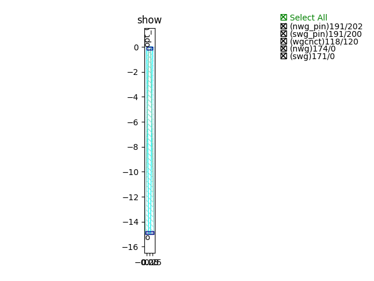
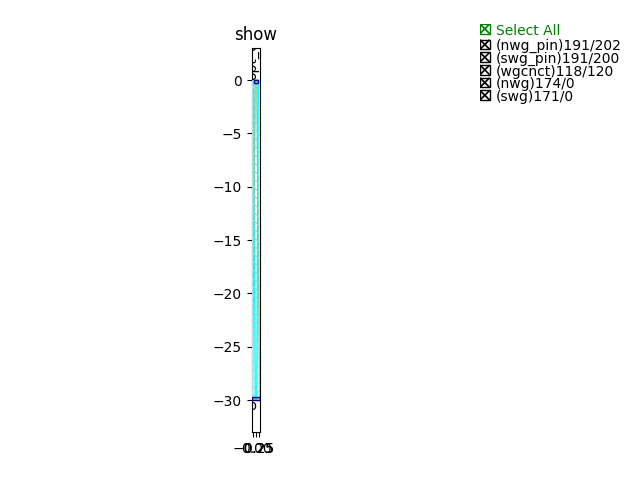
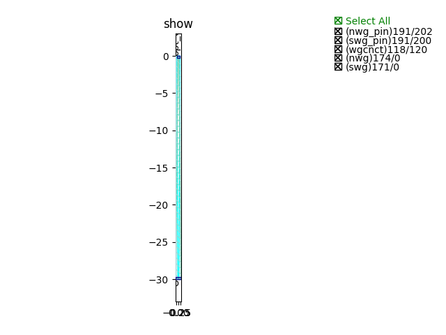
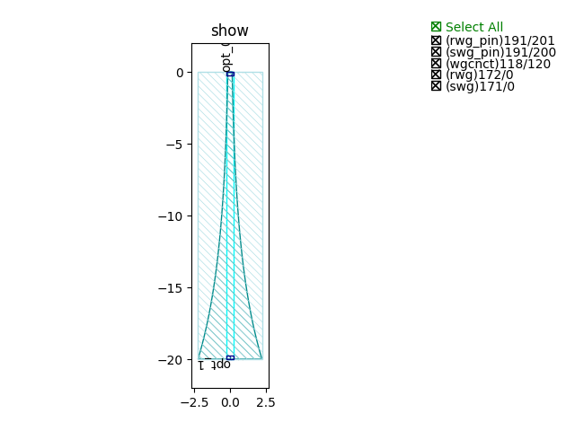
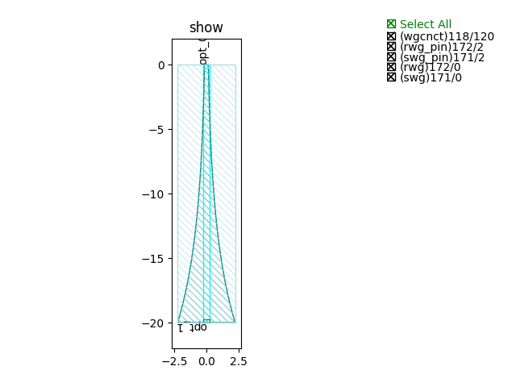

Transition
#############################

SWG2NWG_C_TE
**********************************************************

+-------------------+-----------------------------+-------------+
|     ports         |     waveguide type          | orientation |
+===================+=============================+=============+
|     opt_1         |   TECH.WG.Strip.C.WIRE_TE   |    90       |
+-------------------+-----------------------------+-------------+
|     opt_2         | TECH.WG.SiN_strip.C.WIRE_TE |    270      |
+-------------------+-----------------------------+-------------+

SWG2NWG_C_TM
**********************************************************

+-------------------+-----------------------------+-------------+
|     ports         |     waveguide type          | orientation |
+===================+=============================+=============+
|     opt_1         |   TECH.WG.Strip.C.WIRE_TM   |    90       |
+-------------------+-----------------------------+-------------+
|     opt_2         | TECH.WG.SiN_strip.C.WIRE_TM |    270      |
+-------------------+-----------------------------+-------------+

SWG2NWG_O_TE
**********************************************************
.. image:: ../images/SWG2NWG_O_TE.png

+-------------------+-----------------------------+-------------+
|     ports         |     waveguide type          | orientation |
+===================+=============================+=============+
|     opt_1         |   TECH.WG.Strip.O.WIRE_TE   |    90       |
+-------------------+-----------------------------+-------------+
|     opt_2         | TECH.WG.SiN_strip.O.WIRE_TE |    270      |
+-------------------+-----------------------------+-------------+

SWG2NWG_O_TM
**********************************************************

+-------------------+-----------------------------+-------------+
|     ports         |     waveguide type          | orientation |
+===================+=============================+=============+
|     opt_1         |   TECH.WG.Strip.O.WIRE_TM   |    90       |
+-------------------+-----------------------------+-------------+
|     opt_2         | TECH.WG.SiN_strip.O.WIRE_TM |    270      |
+-------------------+-----------------------------+-------------+

SWG2RWG_C_TE
**********************************************************

+-------------------+-----------------------------+-------------+
|     ports         |     waveguide type          | orientation |
+===================+=============================+=============+
|     opt_1         |   TECH.WG.Strip.C.WIRE_TE   |    90       |
+-------------------+-----------------------------+-------------+
|     opt_2         |   TECH.WG.Ridge.C.WIRE_TE   |    270      |
+-------------------+-----------------------------+-------------+

SWG2RWG_C_TM
**********************************************************

+-------------------+-----------------------------+-------------+
|     ports         |     waveguide type          | orientation |
+===================+=============================+=============+
|     opt_1         |   TECH.WG.Strip.C.WIRE_TM   |    90       |
+-------------------+-----------------------------+-------------+
|     opt_2         |   TECH.WG.Ridge.C.WIRE_TM   |    270      |
+-------------------+-----------------------------+-------------+

SWG2RWG_O_TE
**********************************************************

+-------------------+-----------------------------+-------------+
|     ports         |     waveguide type          | orientation |
+===================+=============================+=============+
|     opt_1         |   TECH.WG.Strip.O.WIRE_TE   |    90       |
+-------------------+-----------------------------+-------------+
|     opt_2         |   TECH.WG.Ridge.O.WIRE_TE   |    270      |
+-------------------+-----------------------------+-------------+

SWG2RWG_O_TM
**********************************************************
.. image:: ../images/SWG2RWG_O_TM.png

+-------------------+-----------------------------+-------------+
|     ports         |     waveguide type          | orientation |
+===================+=============================+=============+
|     opt_1         |   TECH.WG.Strip.O.WIRE_TM   |    90       |
+-------------------+-----------------------------+-------------+
|     opt_2         |   TECH.WG.Ridge.O.WIRE_TM   |    270      |
+-------------------+-----------------------------+-------------+