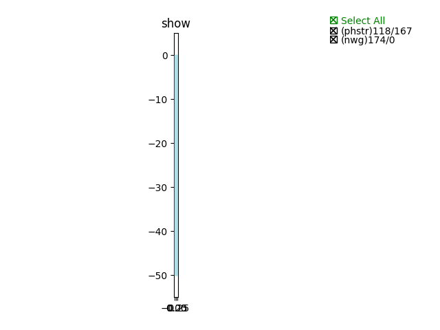
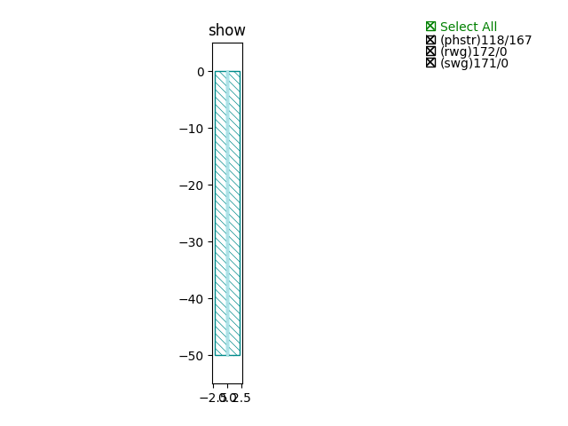
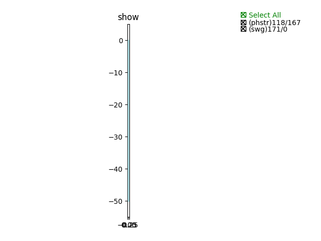
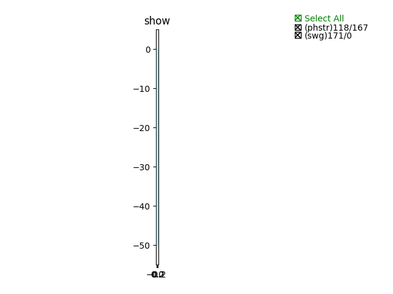

Waveguide
#############################

NWG_C_TE
**********************************************************
.. image:: ../images/NWG_C_TE.png

+-------------------+-----------------------------+-------------+
|     ports         |     waveguide type          | orientation |
+===================+=============================+=============+
|  wg_straight_in0  | TECH.WG.SiN_strip.C.WIRE_TE |    90       |
+-------------------+-----------------------------+-------------+
|  wg_straight_out0 | TECH.WG.SIN_STRIP.C.WIRE_TE |    270      |
+-------------------+-----------------------------+-------------+

NWG_C_TM
**********************************************************
.. image:: ../images/NWG_C_TM.png

+-------------------+-----------------------------+-------------+
|     ports         |     waveguide type          | orientation |
+===================+=============================+=============+
|  wg_straight_in0  | TECH.WG.SiN_strip.C.WIRE_TM |    90       |
+-------------------+-----------------------------+-------------+
|  wg_straight_out0 | TECH.WG.SIN_STRIP.C.WIRE_TM |    270      |
+-------------------+-----------------------------+-------------+

NWG_O_TE
**********************************************************

+-------------------+-----------------------------+-------------+
|     ports         |     waveguide type          | orientation |
+===================+=============================+=============+
|  wg_straight_in0  | TECH.WG.SiN_strip.O.WIRE_TE |    90       |
+-------------------+-----------------------------+-------------+
|  wg_straight_out0 | TECH.WG.SIN_STRIP.O.WIRE_TE |    270      |
+-------------------+-----------------------------+-------------+

NWG_O_TM
**********************************************************
.. image:: ../images/NWG_O_TM.png

+-------------------+-----------------------------+-------------+
|     ports         |     waveguide type          | orientation |
+===================+=============================+=============+
|  wg_straight_in0  | TECH.WG.SiN_strip.O.WIRE_TM |    90       |
+-------------------+-----------------------------+-------------+
|  wg_straight_out0 | TECH.WG.SIN_STRIP.O.WIRE_TM |    270      |
+-------------------+-----------------------------+-------------+

RWG_C_TE
**********************************************************

+-------------------+-----------------------------+-------------+
|     ports         |     waveguide type          | orientation |
+===================+=============================+=============+
|  wg_straight_in0  |   TECH.WG.Ridge.C.WIRE_TE   |    90       |
+-------------------+-----------------------------+-------------+
|  wg_straight_out0 |   TECH.WG.Ridge.C.WIRE_TE   |    270      |
+-------------------+-----------------------------+-------------+

RWG_C_TM
**********************************************************
.. image:: ../images/RWG_C_TM.png

+-------------------+-----------------------------+-------------+
|     ports         |     waveguide type          | orientation |
+===================+=============================+=============+
|  wg_straight_in0  |   TECH.WG.Ridge.C.WIRE_TM   |    90       |
+-------------------+-----------------------------+-------------+
|  wg_straight_out0 |   TECH.WG.Ridge.C.WIRE_TM   |    270      |
+-------------------+-----------------------------+-------------+

RWG_O_TE
**********************************************************
.. image:: ../images/RWG_O_TE.png

+-------------------+-----------------------------+-------------+
|     ports         |     waveguide type          | orientation |
+===================+=============================+=============+
|  wg_straight_in0  |   TECH.WG.Ridge.O.WIRE_TE   |    90       |
+-------------------+-----------------------------+-------------+
|  wg_straight_out0 |   TECH.WG.Ridge.O.WIRE_TE   |    270      |
+-------------------+-----------------------------+-------------+

RWG_O_TM
**********************************************************

+-------------------+-----------------------------+-------------+
|     ports         |     waveguide type          | orientation |
+===================+=============================+=============+
|  wg_straight_in0  |   TECH.WG.Ridge.O.WIRE_TM   |    90       |
+-------------------+-----------------------------+-------------+
|  wg_straight_out0 |   TECH.WG.Ridge.O.WIRE_TM   |    270      |
+-------------------+-----------------------------+-------------+

SWG_C_TE
**********************************************************

+-------------------+-----------------------------+-------------+
|     ports         |     waveguide type          | orientation |
+===================+=============================+=============+
|  wg_straight_in0  |   TECH.WG.Strip.C.WIRE_TE   |    90       |
+-------------------+-----------------------------+-------------+
|  wg_straight_out0 |   TECH.WG.Strip.C.WIRE_TE   |    270      |
+-------------------+-----------------------------+-------------+

SWG_C_TM
**********************************************************
.. image:: ../images/SWG_C_TM.png

+-------------------+-----------------------------+-------------+
|     ports         |     waveguide type          | orientation |
+===================+=============================+=============+
|  wg_straight_in0  |   TECH.WG.Strip.C.WIRE_TM   |    90       |
+-------------------+-----------------------------+-------------+
|  wg_straight_out0 |   TECH.WG.Strip.C.WIRE_TM   |    270      |
+-------------------+-----------------------------+-------------+

SWG_O_TE
**********************************************************
.. image:: ../images/SWG_O_TE.png

+-------------------+-----------------------------+-------------+
|     ports         |     waveguide type          | orientation |
+===================+=============================+=============+
|  wg_straight_in0  |   TECH.WG.Strip.O.WIRE_TE   |    90       |
+-------------------+-----------------------------+-------------+
|  wg_straight_out0 |   TECH.WG.Strip.O.WIRE_TE   |    270      |
+-------------------+-----------------------------+-------------+

SWG_O_TM
**********************************************************

+-------------------+-----------------------------+-------------+
|     ports         |     waveguide type          | orientation |
+===================+=============================+=============+
|  wg_straight_in0  |   TECH.WG.Strip.O.WIRE_TM   |    90       |
+-------------------+-----------------------------+-------------+
|  wg_straight_out0 |   TECH.WG.Strip.O.WIRE_TM   |    270      |
+-------------------+-----------------------------+-------------+