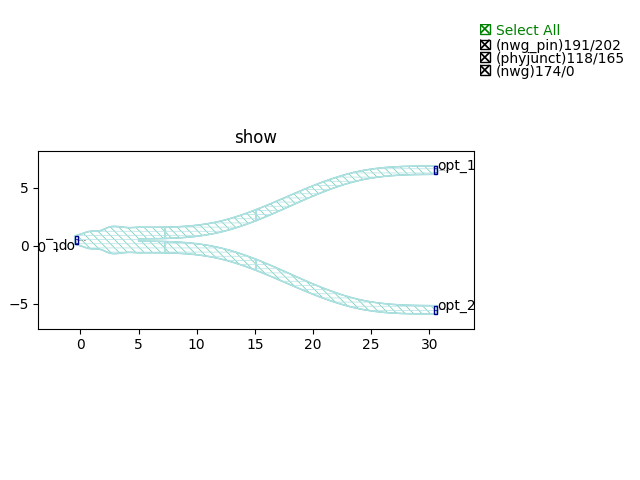
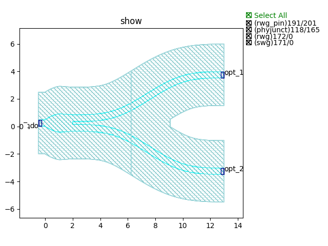
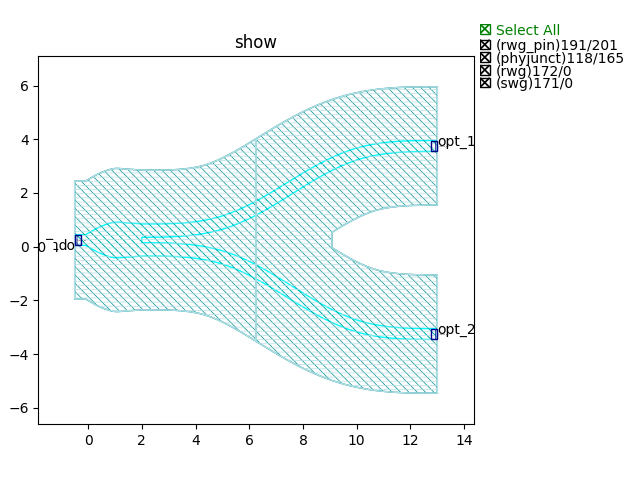
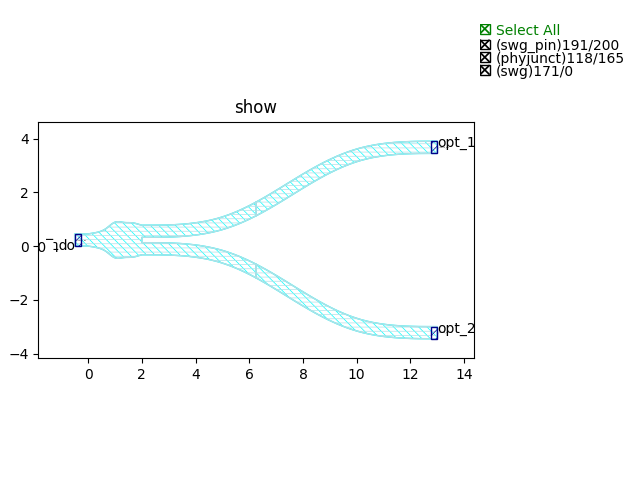
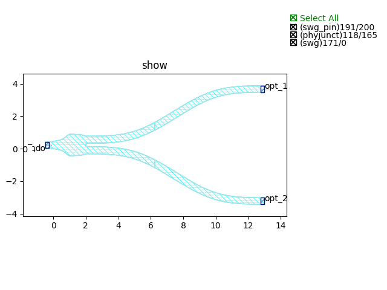

Y Junction
####################################

Yjunction_NWG_TE_C
**************************************************
.. image:: ../images/Yjunction_NWG_TE_C.png

+------------------------------+-----------------------------+-------------+
|          ports               |     waveguide type          | orientation |
+==============================+=============================+=============+
|opt_0                         | TECH.WG.SiN_strip.C.WIRE_TE |     180     |
+------------------------------+-----------------------------+-------------+
|opt_1                         | TECH.WG.SiN_strip.C.WIRE_TE |     0       |
+------------------------------+-----------------------------+-------------+
|opt_2                         | TECH.WG.SiN_strip.C.WIRE_TE |     0       |
+------------------------------+-----------------------------+-------------+

Yjunction_NWG_TE_O
**************************************************
.. image:: ../images/Yjunction_NWG_TE_O.png

+------------------------------+-----------------------------+-------------+
|          ports               |     waveguide type          | orientation |
+==============================+=============================+=============+
|opt_0                         | TECH.WG.SiN_strip.O.WIRE_TE |     180     |
+------------------------------+-----------------------------+-------------+
|opt_1                         | TECH.WG.SiN_strip.O.WIRE_TE |     0       |
+------------------------------+-----------------------------+-------------+
|opt_2                         | TECH.WG.SiN_strip.O.WIRE_TE |     0       |
+------------------------------+-----------------------------+-------------+

Yjunction_NWG_TM_C
**************************************************
.. image:: ../images/Yjunction_NWG_TM_C.png

+------------------------------+-----------------------------+-------------+
|          ports               |     waveguide type          | orientation |
+==============================+=============================+=============+
|opt_0                         | TECH.WG.SiN_strip.C.WIRE_TM |     180     |
+------------------------------+-----------------------------+-------------+
|opt_1                         | TECH.WG.SiN_strip.C.WIRE_TM |     0       |
+------------------------------+-----------------------------+-------------+
|opt_2                         | TECH.WG.SiN_strip.C.WIRE_TM |     0       |
+------------------------------+-----------------------------+-------------+

Yjunction_NWG_TM_O
**************************************************

+------------------------------+-----------------------------+-------------+
|          ports               |     waveguide type          | orientation |
+==============================+=============================+=============+
|opt_0                         | TECH.WG.SiN_strip.O.WIRE_TM |     180     |
+------------------------------+-----------------------------+-------------+
|opt_1                         | TECH.WG.SiN_strip.O.WIRE_TM |     0       |
+------------------------------+-----------------------------+-------------+
|opt_2                         | TECH.WG.SiN_strip.O.WIRE_TM |     0       |
+------------------------------+-----------------------------+-------------+

Yjunction_RWG_TE_C
**************************************************

+------------------------------+-----------------------------+-------------+
|          ports               |     waveguide type          | orientation |
+==============================+=============================+=============+
|opt_0                         |   TECH.WG.Ridge.C.WIRE_TE   |     180     |
+------------------------------+-----------------------------+-------------+
|opt_1                         |   TECH.WG.Ridge.C.WIRE_TE   |     0       |
+------------------------------+-----------------------------+-------------+
|opt_2                         |   TECH.WG.Ridge.C.WIRE_TE   |     0       |
+------------------------------+-----------------------------+-------------+

Yjunction_RWG_TE_O
**************************************************
.. image:: ../images/Yjunction_RWG_TE_O.png

+------------------------------+-----------------------------+-------------+
|          ports               |     waveguide type          | orientation |
+==============================+=============================+=============+
|opt_0                         |   TECH.WG.Ridge.O.WIRE_TE   |     180     |
+------------------------------+-----------------------------+-------------+
|opt_1                         |   TECH.WG.Ridge.O.WIRE_TE   |     0       |
+------------------------------+-----------------------------+-------------+
|opt_2                         |   TECH.WG.Ridge.O.WIRE_TE   |     0       |
+------------------------------+-----------------------------+-------------+

Yjunction_RWG_TM_C
**************************************************
.. image:: ../images/Yjunction_RWG_TM_C.png

+------------------------------+-----------------------------+-------------+
|          ports               |     waveguide type          | orientation |
+==============================+=============================+=============+
|opt_0                         |   TECH.WG.Ridge.C.WIRE_TM   |     180     |
+------------------------------+-----------------------------+-------------+
|opt_1                         |   TECH.WG.Ridge.C.WIRE_TM   |     0       |
+------------------------------+-----------------------------+-------------+
|opt_2                         |   TECH.WG.Ridge.C.WIRE_TM   |     0       |
+------------------------------+-----------------------------+-------------+

Yjunction_RWG_TM_O
**************************************************

+------------------------------+-----------------------------+-------------+
|          ports               |     waveguide type          | orientation |
+==============================+=============================+=============+
|opt_0                         |   TECH.WG.Ridge.O.WIRE_TM   |     180     |
+------------------------------+-----------------------------+-------------+
|opt_1                         |   TECH.WG.Ridge.O.WIRE_TM   |     0       |
+------------------------------+-----------------------------+-------------+
|opt_2                         |   TECH.WG.Ridge.O.WIRE_TM   |     0       |
+------------------------------+-----------------------------+-------------+

Yjunction_SWG_TE_C
**************************************************

+------------------------------+-----------------------------+-------------+
|          ports               |     waveguide type          | orientation |
+==============================+=============================+=============+
|opt_0                         |   TECH.WG.Strip.C.WIRE_TE   |     180     |
+------------------------------+-----------------------------+-------------+
|opt_1                         |   TECH.WG.Strip.C.WIRE_TE   |     0       |
+------------------------------+-----------------------------+-------------+
|opt_2                         |   TECH.WG.Strip.C.WIRE_TE   |     0       |
+------------------------------+-----------------------------+-------------+

Yjunction_SWG_TE_O
**************************************************

+------------------------------+-----------------------------+-------------+
|          ports               |     waveguide type          | orientation |
+==============================+=============================+=============+
|opt_0                         |   TECH.WG.Strip.O.WIRE_TE   |     180     |
+------------------------------+-----------------------------+-------------+
|opt_1                         |   TECH.WG.Strip.O.WIRE_TE   |     0       |
+------------------------------+-----------------------------+-------------+
|opt_2                         |   TECH.WG.Strip.O.WIRE_TE   |     0       |
+------------------------------+-----------------------------+-------------+

Yjunction_SWG_TM_C
**************************************************
.. image:: ../images/Yjunction_SWG_TM_C.png

+------------------------------+-----------------------------+-------------+
|          ports               |     waveguide type          | orientation |
+==============================+=============================+=============+
|opt_0                         |   TECH.WG.Strip.C.WIRE_TM   |     180     |
+------------------------------+-----------------------------+-------------+
|opt_1                         |   TECH.WG.Strip.C.WIRE_TM   |     0       |
+------------------------------+-----------------------------+-------------+
|opt_2                         |   TECH.WG.Strip.C.WIRE_TM   |     0       |
+------------------------------+-----------------------------+-------------+

Yjunction_SWG_TM_O
**************************************************
.. image:: ../images/Yjunction_SWG_TM_O.png

+------------------------------+-----------------------------+-------------+
|          ports               |     waveguide type          | orientation |
+==============================+=============================+=============+
|opt_0                         |   TECH.WG.Strip.O.WIRE_TM   |     180     |
+------------------------------+-----------------------------+-------------+
|opt_1                         |   TECH.WG.Strip.O.WIRE_TM   |     0       |
+------------------------------+-----------------------------+-------------+
|opt_2                         |   TECH.WG.Strip.O.WIRE_TM   |     0       |
+------------------------------+-----------------------------+-------------+